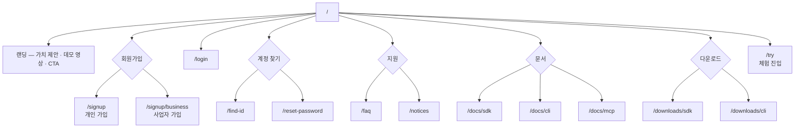
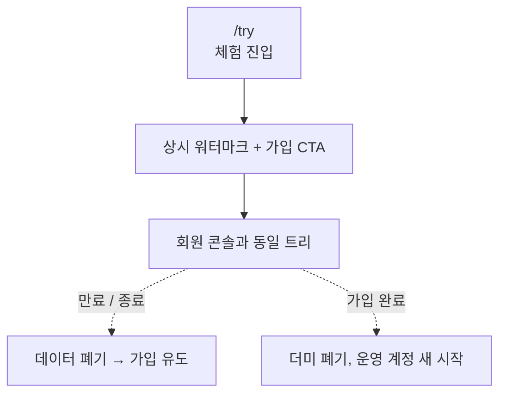
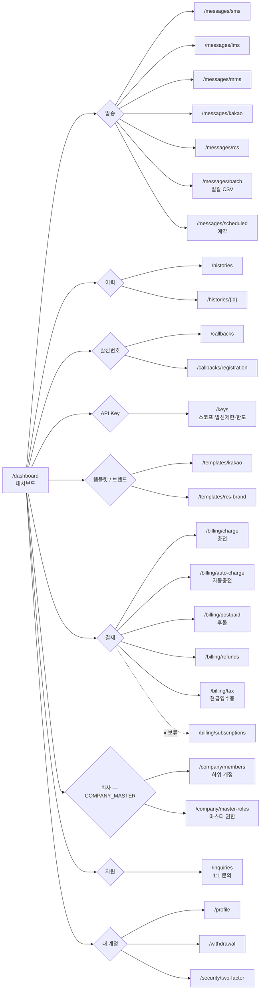
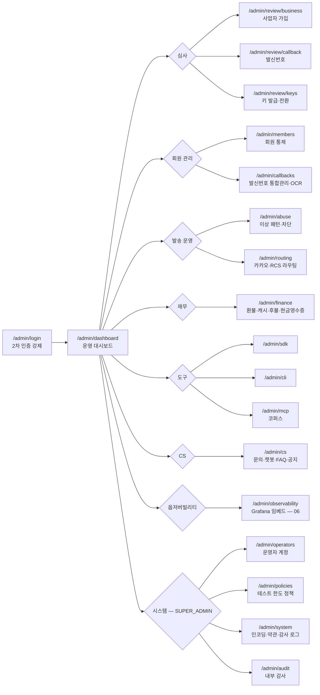

# 정보구조도 (IA) — WiseCan 통합 메시징 서비스

> 작성일 2026-06-01

---

## 0. 도메인 분리 원칙

서비스는 **4개 도메인**으로 분리한다. 도메인별 인증 정책·세션 수명·네비게이션 구조가 다르며, 회원 콘솔과 어드민 콘솔은 **별도 호스트**로 분리해 노출 표면을 격리한다.

| # | 도메인 | 호스트 | 인증 | 세션 | 기본 네비 |
|---|---|---|---|---|---|
| ① | 공개 / 비회원 | `www.wisecan.com` | 익명 | — | 상단 헤더 (랜딩·문서·다운로드·로그인) |
| ② | 비회원 체험 | `www.wisecan.com/try` | 익명 체험 세션 | 30분 무활동 만료 | 회원 콘솔과 동일 사이드바 + 상단 워터마크 |
| ③ | 회원 콘솔 | `app.wisecan.com` | API Key 발급 회원 | 12시간 | 좌측 사이드바 (대시보드·발송·이력·발신번호·키·결제·문의·설정) |
| ④ | 어드민 콘솔 | `admin.wisecan.com` | 운영자 + 2차 인증 + 신뢰 IP | 1시간 | 좌측 사이드바 (심사·회원·발송통제·라우팅·재무·CS·시스템) |

> 회원·어드민은 호스트 자체가 다르므로 회원이 어드민 URL을 알아도 401. 어드민은 운영자 신뢰 IP 화이트리스트로 추가 차단(`NFR-SEC-105`).

---

## 1. ① 공개 / 비회원 사이트맵

---

## 2. ② 비회원 체험 사이트맵

체험 모드는 **회원 콘솔과 완전히 같은 트리**를 더미 데이터로 노출한다 (사용 학습 효과 보존). 진입점만 다르고 화면 트리는 §3을 그대로 따른다.

차단 행위: 실발송, 결제·환불, 세금계산서, KISA 사전 등록, 카카오 템플릿 심사 신청, RCS 브랜드 등록.

---

## 3. ③ 회원 콘솔 사이트맵

> 좌측 사이드바 그룹 순서 = 사용자 빈도순 (발송 → 이력 → 발신번호 → 키 → 템플릿 → 결제 → 회사 → 지원 → 내 계정).
> `COMPANY_MEMBER` 는 회사 그룹 자체가 숨김. `MEMBER`(개인)도 회사 그룹 숨김.

---

## 4. ④ 어드민 콘솔 사이트맵

> `SUPER_ADMIN` 만 시스템 그룹 노출. `ADMIN` 은 위임된 영역만 사이드바 활성.

---

## 5. 페이지 인벤토리

페이지 ID는 기존 `pm/_reference/design/FS.md §2` 의 `PG-*` 체계를 그대로 승계해 추적성을 보존한다. 본 v2 작업으로 신규 추가/이동된 항목은 비고에 `(v2)` 표기.

### 5.1. 공개 / 비회원

| 페이지 ID | 경로 | 인증 | 화면 설계서 § |
|---|---|---|---|
| PG-PUB-001 | `/` 랜딩 | — | `04 §1.1` |
| PG-PUB-002 | `/signup` 개인 가입 | — | `04 §1.2` |
| PG-PUB-003 | `/signup/business` 사업자 가입 | — | `04 §1.3` |
| PG-PUB-004 | `/login` | — | `04 §1.4` |
| PG-PUB-005 | `/find-id`, `/reset-password` | — | `04 §1.5` |
| PG-PUB-006 | `/faq` | — | `04 §1.6` |
| PG-PUB-007 | `/notices` | — | `04 §1.6` |
| PG-PUB-008 | `/docs/{sdk,cli,mcp}` | — | `04 §1.7` |
| PG-PUB-009 | `/downloads/{sdk,cli}` | — | `04 §1.7` |
| PG-TRY-001 | `/try` 체험 진입 | 익명 체험 세션 | `04 §1.8` |

### 5.2. 회원 콘솔

| 페이지 ID | 경로 | 인증 / 스코프 | 화면 설계서 § |
|---|---|---|---|
| PG-DASHBOARD-001 | `/dashboard` | 회원 | `04 §2.1` |
| PG-PROFILE-001 | `/profile` 마이페이지 | 회원 | `04 §2.2` |
| PG-WITHDRAWAL-001 | `/withdrawal` 탈퇴 | 회원 | `04 §2.3` |
| PG-SECURITY-001 | `/security/two-factor` 2차 인증·신뢰 IP | 회원 | `04 §2.4` |
| PG-CO-001 | `/company/members` 하위 계정 | `COMPANY_MASTER` | `04 §2.5` |
| PG-CO-002 | `/company/master-roles` 마스터 권한 | `COMPANY_MASTER` | `04 §2.6` |
| PG-CALLBACK-001 | `/callbacks` 발신번호 목록 | 회원 + `callback:read` | `04 §3.1` |
| PG-CALLBACK-002 | `/callbacks/registration` 등록 | 회원 + `callback:manage` | `04 §3.2` |
| PG-KEY-001 | `/keys` 키 목록·스코프 | 회원 | `04 §4.1` |
| PG-MESSAGE-001 | `/messages/{channel}` 채널별 발송 | 회원 + `send` | `04 §5.1` |
| PG-MESSAGE-002 | `/messages/batch` CSV 일괄 | 회원 + `send` | `04 §5.2` |
| PG-MESSAGE-003 | `/messages/scheduled` 예약 | 회원 + `send` | `04 §5.3` |
| PG-HIST-001 | `/histories` 이력 목록 | 회원 + `history:read` | `04 §6.1` |
| PG-HIST-002 | `/histories/{id}` 상세 | 회원 + `history:read` | `04 §6.2` |
| PG-TPL-001 | `/templates/kakao` 카카오 템플릿 | 회원 + `template:read` | `04 §7.1` |
| PG-TPL-002 | `/templates/rcs-brand` RCS 브랜드 | 회원 + `brand:read` | `04 §7.2` |
| PG-PAY-001 | `/billing/charge` 충전 | 회원 | `04 §8.1` |
| PG-PAY-002 | `/billing/auto-charge` 자동충전 | 회원 | `04 §8.2` |
| PG-PAY-003 | `/billing/postpaid` 후불 | 회원 (사업자) | `04 §8.3` |
| PG-PAY-004 | `/billing/subscriptions` ⏸ 보류 | — | (비활성) |
| PG-PAY-005 | `/billing/refunds` 환불 | 회원 | `04 §8.4` |
| PG-PAY-006 | `/billing/tax` 현금영수증 (세금계산서 보류) | 회원 | `04 §8.5` |
| PG-INQUIRY-001 | `/inquiries` 1:1 문의 | 회원 | `04 §9.1` |

### 5.3. 어드민 콘솔

| 페이지 ID | 경로 | 인증 | 화면 설계서 § |
|---|---|---|---|
| PG-AD-001 | `/admin/login` (2차 인증 강제) | — | `04 §10.1` |
| PG-AD-002 | `/admin/operators` 운영자 계정·권한 | `SUPER_ADMIN` | `04 §10.2` |
| PG-AD-003 | `/admin/review/business` 사업자 심사 | `ADMIN` (위임) | `04 §10.3` |
| PG-AD-004 | `/admin/review/callback` 발신번호 심사 | `ADMIN` | `04 §10.4` |
| PG-AD-005 | `/admin/members` 회원 통제 | `ADMIN` | `04 §10.5` |
| PG-AD-006 | `/admin/abuse` 이상 패턴 | `ADMIN` | `04 §10.6` |
| PG-AD-007 | `/admin/routing` 카카오·RCS 라우팅 | `ADMIN` | `04 §10.7` |
| PG-AD-008 | `/admin/finance` 환불·캐시·후불·현금영수증 | `ADMIN` | `04 §10.8` |
| PG-AD-009 | `/admin/policies` 테스트 한도 정책 | `SUPER_ADMIN` | `04 §10.9` |
| PG-AD-010 | `/admin/review/keys` 키 발급·전환 큐 | `ADMIN` | `04 §10.10` |
| PG-AD-011 | `/admin/{sdk,cli,mcp}` 도구 버전·매뉴얼·코퍼스 | `ADMIN` | `04 §10.11` |
| PG-AD-012 | `/admin/cs` 문의·챗봇·FAQ·공지·위탁 | `ADMIN` | `04 §10.12` |
| PG-AD-013 | `/admin/dashboard` 운영 대시보드·통계 | `ADMIN` | `04 §10.13` |
| PG-AD-014 | `/admin/system` 인코딩·약관·감사 로그 | `SUPER_ADMIN` | `04 §10.14` |
| PG-AD-015 | `/admin/callbacks` 발신번호 통합관리·OCR | `ADMIN` | `04 §10.15` |
| PG-AD-016 | `/admin/audit` 내부 감사 (매년) | `SUPER_ADMIN` | `04 §10.16` |
| PG-AD-017 | `/admin/observability` Grafana 임베드 (대시보드·SLA·KPI) | `ADMIN` (보안·라우팅 대시보드는 `SUPER_ADMIN`) | `06_OBSERVABILITY §5` |

> 페이지 총계 — 공개 10 / 회원 콘솔 23 / 어드민 17 = **50개**. 체험은 회원 콘솔 트리 재사용으로 별도 카운트하지 않음.

---

## 6. 네비게이션·진입 패턴

- **회원 1차 진입 흐름** — 로그인 → `/dashboard` → 사이드바 첫 항목(발송 또는 발신번호 등록 안내 카드).
- **새 회원 온보딩 체크리스트** (대시보드 상단) — ① 발신번호 등록 → ② 결제 수단 등록 (또는 자동충전) → ③ 테스트 키 발급 → ④ 첫 발송. 단계 완료 여부를 시각적으로 표시.
- **체험 → 가입 전환 트리거** — 발송 직후 / 결제 시도 시 / 이력 조회 시 3지점에 가입 CTA 노출.
- **어드민 큐 진입** — 로그인 → `/admin/dashboard` → 사이드바 상단 "심사 그룹"에 처리 대기 건수 뱃지.
- **404 / 권한 부족 / 만료** — 회원 도메인은 `/dashboard` 로, 어드민은 `/admin/login` 으로 라우팅.

---

## 7. URL / 라우팅 컨벤션

- 자원 복수형 + kebab-case (`/messages`, `/callbacks`, `/billing/auto-charge`).
- 동적 세그먼트는 `{id}` 표기 (`/histories/{id}`).
- 어드민 트리는 `/admin/*` prefix 일관 유지. 어드민 도메인 자체가 분리되어 있으나 prefix는 식별성 위해 보존.
- `/api/v1/*` REST API는 별도 (UI 라우팅과 무관). 진입점별 동등성은 `02_FEATURE_SPEC §7.4`.

---

## 8. 빈틈 점검 (1차 검수)

| 점검 항목 | 결과 |
|---|---|
| 모든 액션(`02_FEATURE_SPEC`)에 화면이 매핑되는가 | ✓ 단, 진입점 SDK/MCP/CLI 액션은 화면 X — 문서 페이지(`/docs/*`)로 대체 |
| 회원 권한별 메뉴 비노출 일관성 | ✓ 회사 그룹은 `COMPANY_MASTER` 만, 시스템 그룹은 `SUPER_ADMIN` 만 |
| 보안 민감 액션(키 발급·발신번호·결제)이 MCP에서 비노출 | ✓ MCP 도구로 제공 X. UI 진입점은 별도 페이지로 유지 |
| 체험 모드 대 실제 모드 UI 일관성 | ✓ 동일 트리, 워터마크 + 가입 CTA 만 추가 |
| 어드민·회원 도메인 격리 | ✓ 호스트 분리 + 신뢰 IP + 2차 인증 |
| ⏸ 보류 페이지 정리 | `/billing/subscriptions` 비활성 표기. 어드민 finance 의 구독·세금계산서 영역 비활성 |
