# 데이터 모델 (ERD) — WiseCan 통합 메시징 서비스

> 작성일 2026-06-02

---

## 0. 읽는 법

- 본 문서는 `01_PRD` 비전, `02_FEATURE_SPEC` 액션 7필드, `03_IA` 도메인 4분할, `04_PROJECT_PLAN` WBS를 종합한 **데이터 모델 정본**이다.
- 모델은 **10개 도메인**으로 분할한다. 각 도메인은 ① 한글 사전 표 ② ERD(컬럼·타입·키·관계 포함 단일 ERD) ③ 노트(불변·인덱스·격리) 3단 구성.
- 마지막 §11에 도메인 간 통합 관계도를 둔다 (도메인 루트 엔티티만, 컬럼 없는 압축 뷰).
- **명명 컨벤션**
  - 테이블·컬럼: `snake_case` (Oracle/MySQL 호환)
  - PK: `id BIGINT` (백엔드 `GenerationType.IDENTITY` 또는 시퀀스)
  - 시각: `created_at`, `updated_at` (TIMESTAMP)
  - enum: `VARCHAR(20)` + 코드 상수 (`MEMBER`, `APPROVED` 등)
  - 불리언: `CHAR(1) Y/N` (Oracle 호환) 또는 `BOOLEAN` (MySQL/Postgres) — 마이그레이션 환경에 맞춤
- **회원 명명** — 백엔드 코드(`backend/src/main/java/com/wisecan/unified/domain/Member.java`)가 `member` 테이블을 사용하므로 본 문서도 `member` 로 통일한다. PM 문서의 `accounts` 라는 의미 단위는 그대로 보존하되 물리 테이블명만 `member`.

### 표준 자릿수 가이드

본 프로젝트 DB 는 **MySQL utf8mb4** — `VARCHAR(N)` 의 N 은 **문자(character) 단위** (한글·이모지 포함 1자 = 1 카운트). Oracle 기본 byte semantics 와 다르므로 혼동 없음.

ERD 컬럼 type 표기는 `VARCHAR(N) column_name "코멘트"` 패턴 — mermaid v11 은 type 토큰에 괄호+숫자(`VARCHAR(50)`, `DECIMAL(10,2)`)를 단일 토큰으로 처리하므로 그대로 사용. type 부분 **공백 금지** (`VARCHAR 50` 은 syntax error). 만약 환경에서 깨지면 `VARCHAR_50` 처럼 언더스코어로 결합한다.

| 용도 | 권장 자릿수 | 사유 |
|------|-------------|------|
| 이메일 | 255 | RFC 5321 |
| 비밀번호 해시 (bcrypt/argon2) | 255 | bcrypt 60자, argon2 가변, 안전 마진 |
| 사람 이름 | 100 | 한국 호적 최대 + 한자 포함 |
| 휴대폰·전화번호 | 20 | E.164 + 구분자 |
| IP 주소 | 45 | IPv6 max 39 + IPv4-mapped/zone ID 마진, IPv4 자연 수용 |
| 일반 enum 코드 (status, role, action) | 20 | `ACTIVE`, `COMPANY_MASTER` 등 |
| 짧은 enum (method, channel) | 10 | `SMS`, `OTP`, `KAKAO` 등 |
| 도메인 코드 (term_code, doc_type, scope_code) | 30 | `TOS`, `BIZ_LICENSE` 등 |
| 사업자번호 | 12 | 10자리 + 하이픈 2개 |
| 법인등록번호 | 13 | 13자리 |
| 회사명·상호 | 200 | 일반 사용 |
| 생년월일 (YYYYMMDD) | 8 | 고정 |
| 파일 경로 (cloud_path, local_path 등) | 500 | 클라우드 URL · 로컬 절대경로 공용 자릿수 |
| ULID (send_id 등) | 26 | ULID 표준 |
| UUID | 36 | UUID 표준 |
| 토큰 해시 (sha256 hex) | 64 | SHA-256 hex digest |
| 본인인증 CI | 88 | KISA 표준 |
| 본인인증 DI | 64 | KISA 표준 |
| OTP base32 시드 | 32 | RFC 6238 |
| PG 거래번호·빌키 | 64 | PG 표준 마진 |
| 카드·계좌 마스킹 라벨 | 50 | `1234-****-****-5678` 등 |
| API Key prefix (표시용) | 8 | 시각 식별 |
| API Key hash | 255 | bcrypt/argon2 결과 |
| 짧은 사유·메모 | 500 | reject_reason 등 |
| 긴 본문·OCR·메시지 본문 | TEXT | 가변 |

### 도메인 분할 기준

ERD 가독성과 와이어프레임 매핑을 위해 다음 원칙으로 도메인을 분할한다:

1. **흐름 단위 매핑** — 화면 와이어프레임의 사용자 흐름과 ERD 가 1:1 대응. 예: `/signup` 일반 가입 → §1.1, `/signup/business` 사업자 가입 → §1.2, `/login` + 2FA → §1.3.
2. **공통 vs 특수 분리** — 둘 이상의 흐름이 공유하는 엔티티는 별도 "공통" 절로 묶고, 특정 흐름만의 엔티티는 해당 절에 격리.
3. **한 ERD ≤ 7 엔티티** — 초과 시 가독성·렌더링 크기 모두 떨어지므로 추가 분할.
4. **회원·회사 참조는 stub** — 정본 정의는 단 한 곳, 다른 ERD 에서는 stub 으로 재표기 (아래 §0 stub 패턴).
5. **저장소 일관성** — 한 ERD 안의 엔티티는 같은 저장소(RDB / Redis / 하이브리드) 로 묶기.

### 회원·회사 참조 stub 패턴

회원·회사가 거의 모든 도메인의 hub 라 매번 정본 정의를 반복하면 잡음이 커진다. 따라서:

- **정본 정의** — `MEMBER` 는 §1.1, `COMPANY` 는 §2.1 에만 전체 컬럼 표기
- **stub** — 다른 도메인 ERD 에서 회원·회사 참조가 등장하면 **식별 컬럼만** 재표기. 도메인 ERD 만 봐도 "누가/어느 회사가 한 행위인지" 가 시각적으로 즉시 드러난다.

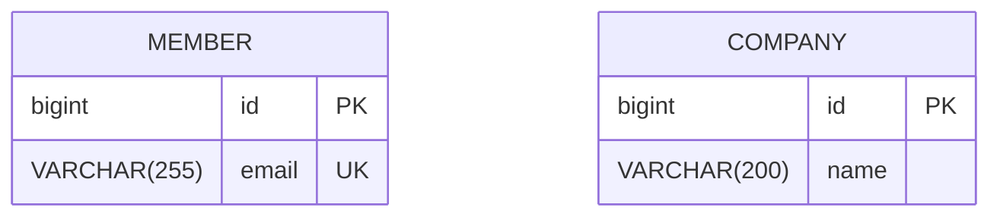
```mermaid
%%{init: {"themeVariables": {"fontSize": "16px"}}}%%
erDiagram
  MEMBER {
    bigint id PK
    VARCHAR(255) email UK
  }
  COMPANY {
    bigint id PK
    VARCHAR(200) name
  }
```

- stub 에는 PK + 식별용 1~2 컬럼만. 전체 정의가 필요하면 §1·§2 정본 참조.
- 익명 도메인(§8 체험)은 회원 참조 없으므로 stub 불요.

---

## 1. 회원·인증

회원 가입·약관 동의·본인인증·로그인 보안·세션을 다루는 도메인. 가입 흐름이 개인과 사업자로 갈리므로 다음 3개 ERD 로 분할한다:

- **§1.1 일반(개인) 회원 가입** — `/signup` 화면 흐름
- **§1.2 사업자 회원 가입** — `/signup/business` + 운영자 심사 큐 (`COMPANY` 생성 포함)
- **§1.3 공통 인증·세션·보안** — 로그인 + 2차 인증 + 신뢰 IP + 세션 (두 회원 유형 공통)

| 테이블 | 한글명 | 저장소 | 정본 위치 | 역할 한 줄 |
|--------|--------|--------|-----------|------------|
| `MEMBER` | 회원 | RDB | §1.1 | 모든 페르소나 단일 본 테이블 (`role` × `member_type`) |
| `TERM_AGREEMENT` | 약관 동의 | RDB | §1.1 | 회원의 약관 코드·버전·필수 여부·동의 시각 (현재 동의 상태의 진실 원천 — 단순 이력 아님) |
| `IDENTITY_VERIFICATION` | 본인인증 봉인 | RDB | §1.1 | PASS 인증 CI/DI 단방향 해시 |
| `BUSINESS_APPLICATION` | 사업자 가입 신청 | RDB | §1.2 | 운영자 심사 큐 헤더 |
| `BUSINESS_DOCUMENT` | 사업자 첨부 서류 | RDB | §1.2 | 사업자 등록증·신분증 OCR |
| `BUSINESS_REVIEW_CALL` | 사업자 심사 통화 녹음 | RDB | §1.2 | 대표자 통화 5년 보존 |
| `TWO_FACTOR_SETTING` | 2차 인증 설정 | RDB | §1.3 | SMS/OTP 방식 + 시드 |
| `TRUSTED_IP` | 신뢰 IP | RDB | §1.3 | 등록 IP 자동 2차 인증 패스 |
| `LOGIN_ATTEMPT` | 로그인 시도 | RDB | §1.3 | 시도 1건당 1행 append-only. 5회 실패 잠금 근거 |
| `AUTH_SESSION` | 세션·리프레시 토큰 메타 | **RDB + Redis** | §1.3 | RDB 해시 + Redis 본체 |

> 이 도메인의 **Redis 전용 키** (RDB 미저장): `verify:phone:*` (인증코드 3분), `pwreset:*` (재설정 토큰 30분), `otp:try:*` (OTP 카운터 15분), `login:lock:*` (잠금 플래그 15분), `captcha:require:*` (CAPTCHA 요구), `blacklist:jwt:*` (Access Token 블랙리스트). 상세는 §14.3.

### 1.1. 일반(개인) 회원 가입

`/signup` 흐름 — 휴대폰 본인인증 → 이메일·비밀번호 입력 → 약관 동의 → 가입 완료. `MEMBER.member_type = PERSONAL` 케이스. `MEMBER` 정본 정의가 본 ERD 에 있고 다른 도메인은 stub 으로 참조.

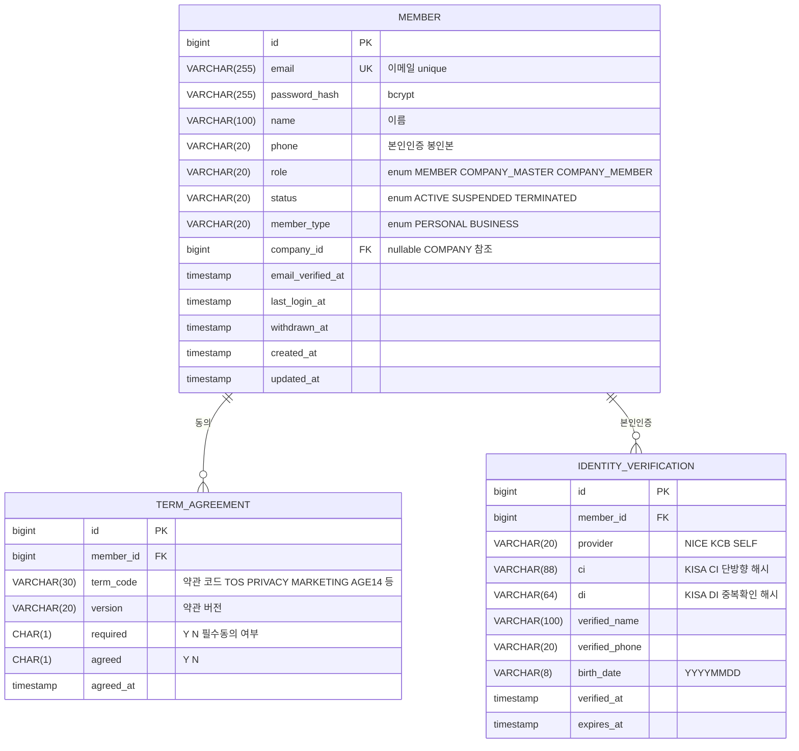
```mermaid
%%{init: {"themeVariables": {"fontSize": "16px"}}}%%
erDiagram
  MEMBER {
    bigint id PK
    VARCHAR(255) email UK "이메일 unique"
    VARCHAR(255) password_hash "bcrypt"
    VARCHAR(100) name "이름"
    VARCHAR(20) phone "본인인증 봉인본"
    VARCHAR(20) role "enum MEMBER COMPANY_MASTER COMPANY_MEMBER"
    VARCHAR(20) status "enum ACTIVE SUSPENDED TERMINATED"
    VARCHAR(20) member_type "enum PERSONAL BUSINESS"
    bigint company_id FK "nullable COMPANY 참조"
    timestamp email_verified_at
    timestamp last_login_at
    timestamp withdrawn_at
    timestamp created_at
    timestamp updated_at
  }
  TERM_AGREEMENT {
    bigint id PK
    bigint member_id FK
    VARCHAR(30) term_code "약관 코드 TOS PRIVACY MARKETING AGE14 등"
    VARCHAR(20) version "약관 버전"
    CHAR(1) required "Y N 필수동의 여부"
    CHAR(1) agreed "Y N"
    timestamp agreed_at
  }
  IDENTITY_VERIFICATION {
    bigint id PK
    bigint member_id FK
    VARCHAR(20) provider "NICE KCB SELF"
    VARCHAR(88) ci "KISA CI 단방향 해시"
    VARCHAR(64) di "KISA DI 중복확인 해시"
    VARCHAR(100) verified_name
    VARCHAR(20) verified_phone
    VARCHAR(8) birth_date "YYYYMMDD"
    timestamp verified_at
    timestamp expires_at
  }
  MEMBER ||--o{ TERM_AGREEMENT : "동의"
  MEMBER ||--o{ IDENTITY_VERIFICATION : "본인인증"
```

- 본 절은 `member_type = PERSONAL` 만 다룬다. `BUSINESS` 는 §1.2 추가 흐름.
- `MEMBER` 정본 정의는 본 ERD 에만. 다른 도메인은 `MEMBER { bigint id PK; VARCHAR(255) email UK }` stub 으로 재표기 (§0 stub 가이드).
- `IDENTITY_VERIFICATION.ci`/`di` 는 본인확인 봉인 — 발신번호 등록(§3) 에서 재사용.

### 1.2. 사업자 회원 가입

`/signup/business` 흐름 — 휴대폰 본인인증 → 사업자 정보 + 서류 업로드 → 운영자 심사 큐 (`SUBMITTED → UNDER_REVIEW → APPROVED/REJECTED`) → 승인 시 `COMPANY` 생성 + `MEMBER.role = COMPANY_MASTER` 자동 부여 (`§2.3 시나리오 ①` 참조).

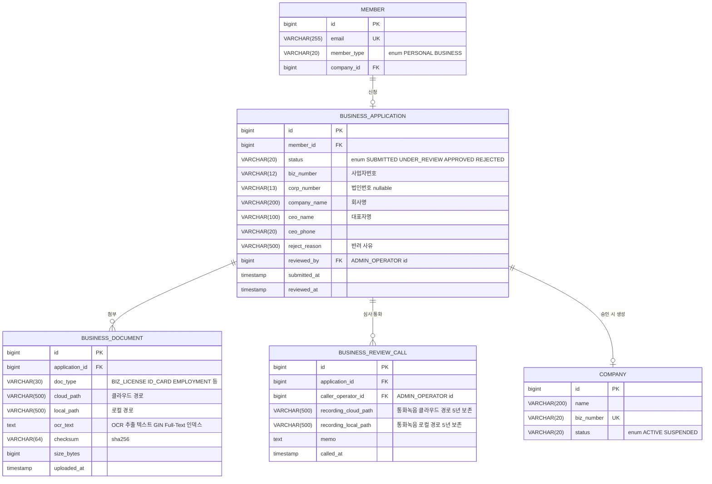
```mermaid
%%{init: {"themeVariables": {"fontSize": "16px"}}}%%
erDiagram
  MEMBER {
    bigint id PK
    VARCHAR(255) email UK
    VARCHAR(20) member_type "enum PERSONAL BUSINESS"
    bigint company_id FK
  }
  COMPANY {
    bigint id PK
    VARCHAR(200) name
    VARCHAR(20) biz_number UK
    VARCHAR(20) status "enum ACTIVE SUSPENDED"
  }
  BUSINESS_APPLICATION {
    bigint id PK
    bigint member_id FK
    VARCHAR(20) status "enum SUBMITTED UNDER_REVIEW APPROVED REJECTED"
    VARCHAR(12) biz_number "사업자번호"
    VARCHAR(13) corp_number "법인번호 nullable"
    VARCHAR(200) company_name "회사명"
    VARCHAR(100) ceo_name "대표자명"
    VARCHAR(20) ceo_phone
    VARCHAR(500) reject_reason "반려 사유"
    bigint reviewed_by FK "ADMIN_OPERATOR id"
    timestamp submitted_at
    timestamp reviewed_at
  }
  BUSINESS_DOCUMENT {
    bigint id PK
    bigint application_id FK
    VARCHAR(30) doc_type "BIZ_LICENSE ID_CARD EMPLOYMENT 등"
    VARCHAR(500) cloud_path "클라우드 경로"
    VARCHAR(500) local_path "로컬 경로"
    text ocr_text "OCR 추출 텍스트 GIN Full-Text 인덱스"
    VARCHAR(64) checksum "sha256"
    bigint size_bytes
    timestamp uploaded_at
  }
  BUSINESS_REVIEW_CALL {
    bigint id PK
    bigint application_id FK
    bigint caller_operator_id FK "ADMIN_OPERATOR id"
    VARCHAR(500) recording_cloud_path "통화녹음 클라우드 경로 5년 보존"
    VARCHAR(500) recording_local_path "통화녹음 로컬 경로 5년 보존"
    text memo
    timestamp called_at
  }
  MEMBER ||--o| BUSINESS_APPLICATION : "신청"
  BUSINESS_APPLICATION ||--o{ BUSINESS_DOCUMENT : "첨부"
  BUSINESS_APPLICATION ||--o{ BUSINESS_REVIEW_CALL : "심사 통화"
  BUSINESS_APPLICATION ||--o| COMPANY : "승인 시 생성"
```

- `MEMBER` 정본은 §1.1, `COMPANY` 정본은 §2. 본 ERD 에는 두 엔티티 모두 stub 으로 재표기.
- 사업자 가입은 `MEMBER` INSERT 와 동시에 `BUSINESS_APPLICATION` INSERT. 승인 시 `COMPANY` 생성 + `MEMBER.company_id` UPDATE + `MEMBER.role = COMPANY_MASTER` 단일 트랜잭션.
- `BUSINESS_REVIEW_CALL` 통화녹음 5년 보존 — `recording_cloud_path` + `recording_local_path` 이중 저장 (`02_FEATURE_SPEC §12.1`).

### 1.3. 공통 인증·세션·보안

`/login` + `/security/two-factor` 흐름 — 모든 회원 유형이 공유하는 로그인 + 2차 인증 + 신뢰 IP + 세션. 회원 유형(`PERSONAL` / `BUSINESS`) 무관하게 동일 정책.

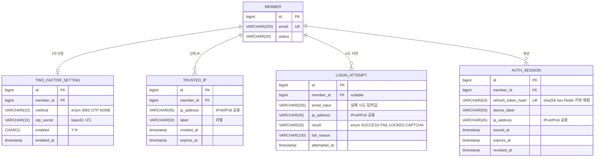
```mermaid
%%{init: {"themeVariables": {"fontSize": "16px"}}}%%
erDiagram
  MEMBER {
    bigint id PK
    VARCHAR(255) email UK
    VARCHAR(20) status
  }
  TWO_FACTOR_SETTING {
    bigint id PK
    bigint member_id FK
    VARCHAR(10) method "enum SMS OTP NONE"
    VARCHAR(32) otp_secret "base32 시드"
    CHAR(1) enabled "Y N"
    timestamp enabled_at
  }
  TRUSTED_IP {
    bigint id PK
    bigint member_id FK
    VARCHAR(45) ip_address "IPv4/IPv6 공용"
    VARCHAR(50) label "라벨"
    timestamp created_at
    timestamp expires_at
  }
  LOGIN_ATTEMPT {
    bigint id PK
    bigint member_id FK "nullable"
    VARCHAR(255) email_input "실패 시도 입력값"
    VARCHAR(45) ip_address "IPv4/IPv6 공용"
    VARCHAR(20) result "enum SUCCESS FAIL LOCKED CAPTCHA"
    VARCHAR(100) fail_reason
    timestamp attempted_at
  }
  AUTH_SESSION {
    bigint id PK
    bigint member_id FK
    VARCHAR(64) refresh_token_hash UK "sha256 hex Redis 키와 매핑"
    VARCHAR(50) device_label
    VARCHAR(45) ip_address "IPv4/IPv6 공용"
    timestamp issued_at
    timestamp expires_at
    timestamp revoked_at
  }
  MEMBER ||--o| TWO_FACTOR_SETTING : "2차 인증"
  MEMBER ||--o{ TRUSTED_IP : "신뢰 IP"
  MEMBER ||--o{ LOGIN_ATTEMPT : "시도 이력"
  MEMBER ||--o{ AUTH_SESSION : "세션"
```

- `MEMBER` 는 stub. 정본은 §1.1.
- `LOGIN_ATTEMPT.result = FAIL` 5회 → 15분 잠금 + CAPTCHA. 잠금 플래그는 Redis `login:lock:{memberId}`, 영구 이력은 본 테이블.
- `AUTH_SESSION.refresh_token_hash` 는 RDB 메타, 토큰 본체는 Redis `refresh:{hash}` (TTL = 리프레시 만료).
- `TRUSTED_IP` 에 등록된 IP 에서 로그인 시 2차 인증 자동 패스.

### 1.4. 노트

- `MEMBER.email` UNIQUE — 동일 이메일 재가입 차단.
- `MEMBER.role` × `member_type` 조합으로 페르소나 식별:
  - `PERSONAL` + `MEMBER` — 개인 회원 (§1.1 흐름)
  - `BUSINESS` + `COMPANY_MASTER` — 사업자 가입 승인된 회사 마스터 (§1.2 + §2)
  - `BUSINESS` + `COMPANY_MEMBER` — 마스터 초대로 합류한 하위 계정 (§2)
- `IDENTITY_VERIFICATION.ci`/`di` 는 본인확인 봉인 — 발신번호 등록(§3.1)·재가입 차단·KYC 재검증에 재사용.
- `LOGIN_ATTEMPT` 인덱스: `(member_id, attempted_at DESC)`.
- `MEMBER` stub 패턴 — 다른 도메인 ERD 에서는 `MEMBER { bigint id PK; VARCHAR(255) email UK }` 로 재표기 (§0 stub 가이드).

---

## 2. 회사·하위 계정

회사 본체 + 하위 계정 초대 + 마스터 권한 이관 이력 도메인. 흐름이 두 갈래라 분할:

- **§2.1 회사 본체 + 하위 계정 초대** — `/company/members` 화면 흐름
- **§2.2 마스터 권한 이관 이력** — `/company/master-roles` 화면 + 운영자 강제 회수

| 테이블 | 한글명 | 저장소 | 정본 위치 | 역할 한 줄 |
|--------|--------|--------|-----------|------------|
| `COMPANY` | 회사 | RDB | §2.1 | 사업자 가입 승인 시 1행 생성. 마스터 식별은 `MEMBER.role` 단일 진실 |
| `COMPANY_INVITATION` | 하위 계정 초대 | RDB | §2.1 | 마스터가 발행하는 일회용 가입 링크 (토큰 해시) |
| `COMPANY_ROLE_LOG` | 마스터 권한 이관 이력 | RDB | §2.2 | GRANT TRANSFER AUTO_TRANSFER REVOKE 4종 감사 이력 |

### 2.1. 회사 본체 + 하위 계정 초대

사업자 가입 승인 시 `COMPANY` 생성 (§1.2 흐름 끝). 회사 마스터는 `/company/members` 에서 직원 초대 링크 발급 → 수락 시 `MEMBER` INSERT (company_id 자동 부여, role=COMPANY_MEMBER).

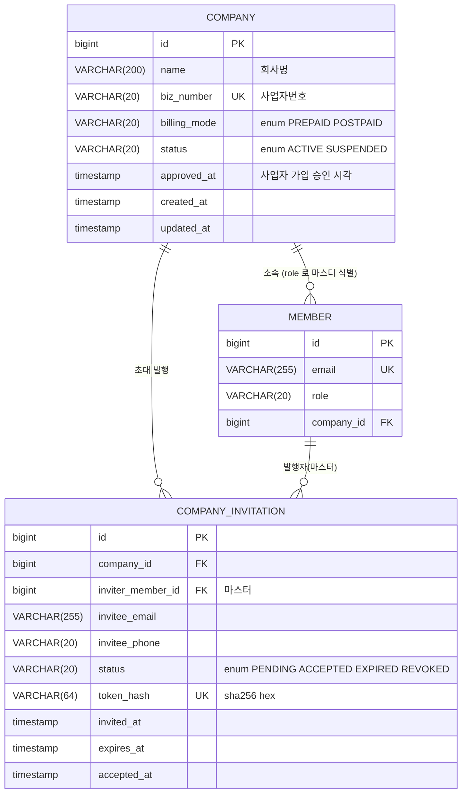
```mermaid
%%{init: {"themeVariables": {"fontSize": "16px"}}}%%
erDiagram
  COMPANY {
    bigint id PK
    VARCHAR(200) name "회사명"
    VARCHAR(20) biz_number UK "사업자번호"
    VARCHAR(20) billing_mode "enum PREPAID POSTPAID"
    VARCHAR(20) status "enum ACTIVE SUSPENDED"
    timestamp approved_at "사업자 가입 승인 시각"
    timestamp created_at
    timestamp updated_at
  }
  MEMBER {
    bigint id PK
    VARCHAR(255) email UK
    VARCHAR(20) role
    bigint company_id FK
  }
  COMPANY_INVITATION {
    bigint id PK
    bigint company_id FK
    bigint inviter_member_id FK "마스터"
    VARCHAR(255) invitee_email
    VARCHAR(20) invitee_phone
    VARCHAR(20) status "enum PENDING ACCEPTED EXPIRED REVOKED"
    VARCHAR(64) token_hash UK "sha256 hex"
    timestamp invited_at
    timestamp expires_at
    timestamp accepted_at
  }
  COMPANY ||--o{ MEMBER : "소속 (role 로 마스터 식별)"
  COMPANY ||--o{ COMPANY_INVITATION : "초대 발행"
  MEMBER ||--o{ COMPANY_INVITATION : "발행자(마스터)"
```

- `MEMBER` 는 stub. 정본은 §1.1. `MEMBER.role = COMPANY_MASTER` 인 멤버가 회사 마스터.
- 회사당 마스터 1명 강제 — DB level 부분 UNIQUE 인덱스 (§2.3 참조).
- `COMPANY_INVITATION.token_hash` — 일회용 가입 링크. 수락 시 새 `MEMBER` INSERT + `company_id` 자동 부여.

### 2.2. 마스터 권한 이관 이력

마스터 권한 부여·이관·자동 전이·회수의 감사 이력. 4종 액션 모두 본 테이블에 1행씩 INSERT.

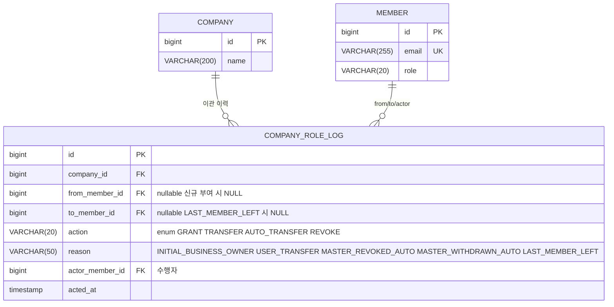
```mermaid
%%{init: {"themeVariables": {"fontSize": "16px"}}}%%
erDiagram
  COMPANY {
    bigint id PK
    VARCHAR(200) name
  }
  MEMBER {
    bigint id PK
    VARCHAR(255) email UK
    VARCHAR(20) role
  }
  COMPANY_ROLE_LOG {
    bigint id PK
    bigint company_id FK
    bigint from_member_id FK "nullable 신규 부여 시 NULL"
    bigint to_member_id FK "nullable LAST_MEMBER_LEFT 시 NULL"
    VARCHAR(20) action "enum GRANT TRANSFER AUTO_TRANSFER REVOKE"
    VARCHAR(50) reason "INITIAL_BUSINESS_OWNER USER_TRANSFER MASTER_REVOKED_AUTO MASTER_WITHDRAWN_AUTO LAST_MEMBER_LEFT"
    bigint actor_member_id FK "수행자"
    timestamp acted_at
  }
  COMPANY ||--o{ COMPANY_ROLE_LOG : "이관 이력"
  MEMBER ||--o{ COMPANY_ROLE_LOG : "from/to/actor"
```

- `COMPANY`·`MEMBER` 모두 stub. 정본은 §2.1 / §1.1.
- `action` 카탈로그 4종 — `GRANT` (초기 부여) / `TRANSFER` (사용자 명시 이관) / `AUTO_TRANSFER` (자동 전이) / `REVOKE` (마지막 1인 탈퇴로 회사 SUSPENDED).
- 자동 전이 정책과 4종 시나리오는 §2.3 노트.

### 2.3. 노트

- **회사 ↔ 마스터 관계는 단일 진실 원천** — `MEMBER.role = COMPANY_MASTER` + `MEMBER.company_id` 조합. `COMPANY` 에 `master_member_id` 같은 역방향 FK 두지 않음. 양방향 FK 의 동기화 부담 + 같은 사실 중복 보관 제거.
- **회사당 마스터 1명 강제** — DB level 부분 UNIQUE 인덱스로 보장:
  - Postgres: `CREATE UNIQUE INDEX uq_company_master ON member(company_id) WHERE role='COMPANY_MASTER'`
  - Oracle: function-based unique index `ON member(CASE WHEN role='COMPANY_MASTER' THEN company_id END)`
  - MySQL 8+: virtual generated column + UNIQUE — `master_company_id BIGINT AS (CASE WHEN role='COMPANY_MASTER' THEN company_id END) VIRTUAL` + `UNIQUE(master_company_id)`

#### 마스터 라이프사이클 4가지 시나리오

**① 초기 부여 (사업자 가입 승인)** — 0명 구간 없음

```
BUSINESS_APPLICATION.status='APPROVED' 트랜잭션:
  INSERT company (...)
  UPDATE member SET company_id=newCompanyId, role='COMPANY_MASTER' WHERE id=applicantId
  INSERT company_role_log (action='GRANT', from_member_id=NULL, to_member_id=applicantId,
                               reason='INITIAL_BUSINESS_OWNER', actor_member_id=operatorId)
COMMIT
```

**② 명시적 이관 (TRANSFER)** — 마스터 본인이 후보 지정

```
1. UPDATE member SET role='COMPANY_MEMBER' WHERE id = oldMaster
2. UPDATE member SET role='COMPANY_MASTER' WHERE id = newMaster
3. INSERT company_role_log (action='TRANSFER', from=old, to=new, ...)
```

순서 중요 — 신규 임명을 먼저 하면 부분 UNIQUE 제약 위반. 1과 2 사이 마스터 0명 상태는 트랜잭션 안에 봉인되므로 외부 가시성 X.

**③ 회수·탈퇴 시 자동 전이 (AUTO_TRANSFER)** — 마스터 0명 방지 정책

회수(운영자 강제) 또는 마스터 본인 탈퇴 시, 후보 자동 선출 후 단일 트랜잭션에서 즉시 전이.

```
1. 후보 선출 (FOR UPDATE 잠금):
   SELECT id FROM member
   WHERE company_id = :companyId AND id != :currentMasterId AND status = 'ACTIVE'
   ORDER BY created_at ASC, id ASC
   LIMIT 1 FOR UPDATE
2. 후보 있음:
   UPDATE member SET role='COMPANY_MEMBER' WHERE id = currentMasterId
   UPDATE member SET role='COMPANY_MASTER' WHERE id = nextMasterId
   INSERT company_role_log (action='AUTO_TRANSFER', from=current, to=next,
                                reason='MASTER_REVOKED_AUTO' or 'MASTER_WITHDRAWN_AUTO',
                                actor_member_id=current or operatorId)
   → 후보에게 인앱·이메일 알림 "회사 마스터 권한이 자동으로 부여되었습니다"
```

선출 정렬키 `(created_at ASC, id ASC)` — 가장 먼저 가입한 활성 멤버. 동시간 가입 tie-breaking 은 `id ASC` (시퀀스 단조 증가).

**④ 후보 0명 — 회사 SUSPENDED**

마스터 단독 회사에서 마스터가 탈퇴하는 경우 (회사 멤버가 0명이 됨).

```
1. UPDATE member SET role='COMPANY_MEMBER' WHERE id = currentMasterId  (또는 status=TERMINATED)
2. UPDATE company SET status='SUSPENDED' WHERE id = companyId
3. INSERT company_role_log (action='REVOKE', from=current, to=NULL, reason='LAST_MEMBER_LEFT')
4. → 회사 발신번호·키·발송 자동 중단 (`02_FEATURE_SPEC §12.3` 연쇄 처리와 동일)
   → 회사 부활은 운영자 개입 필요 (신규 마스터 임명 또는 사업자 가입 재신청)
```

#### 기타

- `MEMBER.company_id` 가 NULL 이면 개인 회원, NOT NULL 이면 회사 소속. 회사 그룹 사이드바는 `MEMBER.role = COMPANY_MASTER` 인 사용자에게만 노출 (`03_IA §3`).
- `COMPANY_INVITATION.token_hash` — 일회용 가입 링크 해시. 회사 마스터가 발급, 하위 계정 수락 시 `MEMBER` INSERT (company_id 자동 부여, role=COMPANY_MEMBER) + `accepted_at` 기록.
- `COMPANY_ROLE_LOG.action` 카탈로그 — `GRANT` / `TRANSFER` / `AUTO_TRANSFER` / `REVOKE` 4종. `AUTO_TRANSFER` 와 `TRANSFER` 를 분리해 자동 정책 발동 vs 사용자 의도 명시 행위를 감사 시 구분.

---

## 3. 발신번호 (Callback)

KISA 사전 등록 자동 연계, 4 케이스(개인 휴대폰·개인 비휴대폰·임직원·법인 대표번호) 등록 흐름·서류·심사 이력. 흐름이 등록·증빙 vs 심사·외부 연계로 갈리므로 분할:

- **§3.1 발신번호 등록·증빙** — `/callbacks/registration` 화면
- **§3.2 심사·KISA 연계** — `/admin/review/callback` + KISA 자동 연계

| 테이블 | 한글명 | 저장소 | 정본 위치 | 역할 한 줄 |
|--------|--------|--------|-----------|------------|
| `CALLBACK` | 발신번호 | **RDB + Redis** | §3.1 | 4 등록 케이스 단일 수용. KISA 등록 여부는 Redis 캐시 |
| `CALLBACK_DOCUMENT` | 발신번호 증빙 서류 | RDB | §3.1 | 재직증명서·통신서비스 이용 증명서 OCR |
| `CALLBACK_REVIEW` | 발신번호 심사 액션 | RDB | §3.2 | 운영자 승인·반려·재제출·위조 의심 액션 1건당 1행 |
| `KISA_REGISTRATION` | KISA 사전 등록 연계 | RDB | §3.2 | 외부 API raw 페이로드·응답 보존 |

> 이 도메인의 **Redis 전용 키**: `lock:kisa:{phone}` (KISA 호출 중복 방지 락 60초), `kisa:cache:{phone}` (발송 검증 hot path 캐시 10분), `caller:registered:{memberId}` (회원의 등록 발신번호 Set 캐시 10분).

### 3.1. 발신번호 등록·증빙

회원이 `/callbacks/registration` 에서 4 케이스 중 하나로 발신번호 등록. 증빙 서류는 임직원·법인 케이스에서 필수.

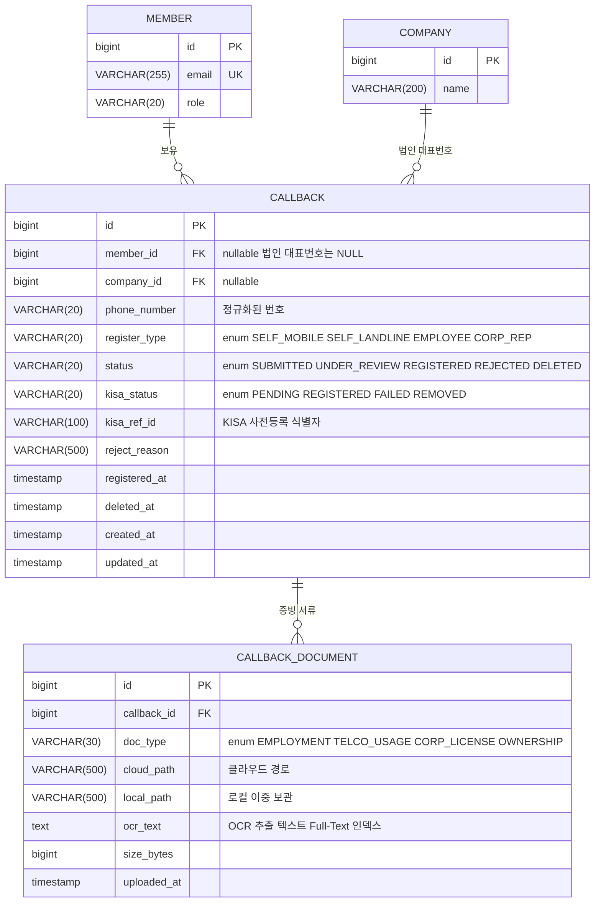
```mermaid
%%{init: {"themeVariables": {"fontSize": "16px"}}}%%
erDiagram
  MEMBER {
    bigint id PK
    VARCHAR(255) email UK
    VARCHAR(20) role
  }
  COMPANY {
    bigint id PK
    VARCHAR(200) name
  }
  CALLBACK {
    bigint id PK
    bigint member_id FK "nullable 법인 대표번호는 NULL"
    bigint company_id FK "nullable"
    VARCHAR(20) phone_number "정규화된 번호"
    VARCHAR(20) register_type "enum SELF_MOBILE SELF_LANDLINE EMPLOYEE CORP_REP"
    VARCHAR(20) status "enum SUBMITTED UNDER_REVIEW REGISTERED REJECTED DELETED"
    VARCHAR(20) kisa_status "enum PENDING REGISTERED FAILED REMOVED"
    VARCHAR(100) kisa_ref_id "KISA 사전등록 식별자"
    VARCHAR(500) reject_reason
    timestamp registered_at
    timestamp deleted_at
    timestamp created_at
    timestamp updated_at
  }
  CALLBACK_DOCUMENT {
    bigint id PK
    bigint callback_id FK
    VARCHAR(30) doc_type "enum EMPLOYMENT TELCO_USAGE CORP_LICENSE OWNERSHIP"
    VARCHAR(500) cloud_path "클라우드 경로"
    VARCHAR(500) local_path "로컬 이중 보관"
    text ocr_text "OCR 추출 텍스트 Full-Text 인덱스"
    bigint size_bytes
    timestamp uploaded_at
  }
  MEMBER ||--o{ CALLBACK : "보유"
  COMPANY ||--o{ CALLBACK : "법인 대표번호"
  CALLBACK ||--o{ CALLBACK_DOCUMENT : "증빙 서류"
```

- `MEMBER`·`COMPANY` 는 stub. 정본은 §1.1 / §2.1.
- `CALLBACK.phone_number` **활성 등록 1개 강제** — 정규화된 번호 기준으로 `status ∈ {SUBMITTED, UNDER_REVIEW, REGISTERED}` 인 row 는 **전 시스템에 1개**만 허용 (부분 UNIQUE 인덱스, §11 INV-16). `REJECTED`·`DELETED` 는 종료 상태로 보고 동일 번호 재등록 가능. `register_type` 만 다른 동시 활성 등록(같은 번호가 `SELF_MOBILE` 과 `EMPLOYEE` 로 동시에 살아있는 케이스)은 더 이상 허용하지 않는다.
- 소유권 이관(재등록·운영자 강제 회수 포함)은 §3.2 `CALLBACK_OWNERSHIP_LOG` 이력 + 기존 row 의 종료 상태 전이 후에만 신규 row INSERT 허용.
- 4 등록 케이스 흐름 (`02_FEATURE_SPEC §4.1~4.4`):
  - `SELF_MOBILE` — `IDENTITY_VERIFICATION` 의 본인 휴대폰과 일치 시 즉시 `REGISTERED`. 증빙 서류 없음.
  - `SELF_LANDLINE` — 통신사 명의 확인 추가 본인인증.
  - `EMPLOYEE`/`CORP_REP` — `CALLBACK_DOCUMENT` 업로드 + 운영자 심사 큐 (§3.2).

### 3.2. 심사·KISA 연계

운영자가 `/admin/review/callback` 에서 임직원·법인 케이스 심사. 승인 시 KISA 사전 등록 API 자동 호출.

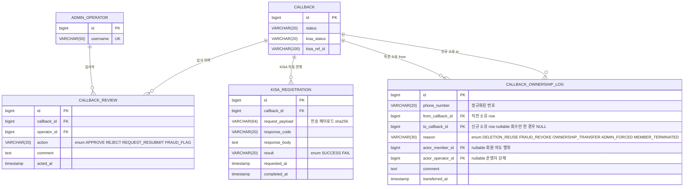
```mermaid
%%{init: {"themeVariables": {"fontSize": "16px"}}}%%
erDiagram
  CALLBACK {
    bigint id PK
    VARCHAR(20) status
    VARCHAR(20) kisa_status
    VARCHAR(100) kisa_ref_id
  }
  ADMIN_OPERATOR {
    bigint id PK
    VARCHAR(50) username UK
  }
  CALLBACK_REVIEW {
    bigint id PK
    bigint callback_id FK
    bigint operator_id FK
    VARCHAR(20) action "enum APPROVE REJECT REQUEST_RESUBMIT FRAUD_FLAG"
    text comment
    timestamp acted_at
  }
  KISA_REGISTRATION {
    bigint id PK
    bigint callback_id FK
    VARCHAR(64) request_payload "전송 페이로드 sha256"
    VARCHAR(20) response_code
    text response_body
    VARCHAR(20) result "enum SUCCESS FAIL"
    timestamp requested_at
    timestamp completed_at
  }
  CALLBACK_OWNERSHIP_LOG {
    bigint id PK
    VARCHAR(20) phone_number "정규화된 번호"
    bigint from_callback_id FK "직전 소유 row"
    bigint to_callback_id FK "신규 소유 row nullable 회수만 한 경우 NULL"
    VARCHAR(30) reason "enum DELETION_REUSE FRAUD_REVOKE OWNERSHIP_TRANSFER ADMIN_FORCED MEMBER_TERMINATED"
    bigint actor_member_id FK "nullable 회원 의도 행위"
    bigint actor_operator_id FK "nullable 운영자 강제"
    text comment
    timestamp transferred_at
  }
  CALLBACK ||--o{ CALLBACK_REVIEW : "심사 이력"
  ADMIN_OPERATOR ||--o{ CALLBACK_REVIEW : "심사자"
  CALLBACK ||--o{ KISA_REGISTRATION : "KISA 자동 연계"
  CALLBACK ||--o{ CALLBACK_OWNERSHIP_LOG : "직전 소유 from"
  CALLBACK ||--o{ CALLBACK_OWNERSHIP_LOG : "신규 소유 to"
```

- `CALLBACK`·`ADMIN_OPERATOR` 모두 stub. 정본은 §3.1 / §9.1.
- `KISA_REGISTRATION` 은 어댑터 격리 — KISA API 변경(`04_PROJECT_PLAN §R-02`) 대비 raw payload 보존.
- `CALLBACK_OWNERSHIP_LOG` 는 동일 정규화 `phone_number` 의 활성 소유권이 바뀌는 모든 사건의 단일 진실 원천. 동작 패턴:
  1. 기존 row 종료 상태 전이 (`status` → `DELETED`/`REJECTED`) + KISA 연쇄 해제 (`kisa_status` → `REMOVED`).
  2. `CALLBACK_OWNERSHIP_LOG` INSERT (`from_callback_id` 필수, `to_callback_id` 는 즉시 재등록되는 경우만).
  3. 신규 소유자가 등록 신청하면 새 `CALLBACK` row INSERT (활성 1개 부분 UNIQUE 통과). 이후 `to_callback_id` 를 채워 이력 마감.
- `reason` 카탈로그: `DELETION_REUSE` (회원이 본인 등록 삭제 후 재등록), `FRAUD_REVOKE` (위조 의심 운영자 회수), `OWNERSHIP_TRANSFER` (회사 간 또는 회원 간 의도적 이관), `ADMIN_FORCED` (분쟁 해결 운영자 강제), `MEMBER_TERMINATED` (회원 해지 연쇄).

### 3.3. 노트

- 회원 정지·해지 시 `CALLBACK.status = DELETED` + KISA `REMOVED` 연쇄 처리(`02_FEATURE_SPEC §12.3`) + `CALLBACK_OWNERSHIP_LOG` 에 `reason='MEMBER_TERMINATED'` 이력 INSERT.
- **활성 등록 1개 강제** — 동일 정규화 `phone_number` 에 대해 `status ∈ {SUBMITTED, UNDER_REVIEW, REGISTERED}` 행은 1개만. `register_type` 으로만 구분되던 이전 모델은 폐기 — 같은 실제 번호가 `SELF_MOBILE` 과 `EMPLOYEE` 로 동시에 존재하는 다중 소유 모호성을 제거한다. DB 강제는 부분 UNIQUE 인덱스(§11 인덱스 표).
- KISA 연계 분산 락 — 동시 등록 신청 시 `lock:kisa:{phone}` (Redis SETNX 60초) 으로 중복 호출 방지.
- 발송 검증 hot path — `kisa:cache:{phone}` 캐시 미스 시에만 `KISA_REGISTRATION.result=SUCCESS` 확인 (§5.3).

---

## 4. API Key·스코프

테스트/운영 키, 12종 스코프, 발신번호 화이트리스트, 일일 한도, 조회 범위 정책. 흐름이 발급·심사 / 권한 설정 / 호출 이력 3 갈래라 분할:

- **§4.1 키 발급·심사·만료** — `/keys` 발급 신청 + `/admin/review/keys` 운영자 심사
- **§4.2 권한·한도·발신번호 제한** — 키 상세 설정 (스코프 / 화이트리스트 / 한도)
- **§4.3 호출 이력** — `wsc.send.sms` 등 도구별 호출 통계

| 테이블 | 한글명 | 저장소 | 정본 위치 | 역할 한 줄 |
|--------|--------|--------|-----------|------------|
| `API_KEY` | API 키 | **RDB + Redis** | §4.1 | 평문 미저장 (해시만). 운영자 **승인 시점에만 row 발급**. 인증 hot path 캐시 `auth:apikey:{hash}` |
| `API_KEY_REQUEST` | 키 발급·운영전환 신청 큐 | RDB | §4.1 | 테스트 발급·운영 전환 신청·심사 단일 테이블. 승인 시 `API_KEY` 발급 |
| `API_KEY_SCOPE` | 키별 권한 스코프 | **RDB + Redis** | §4.2 | 12종 카탈로그 다중 부여 |
| `API_KEY_CALLBACK_WHITELIST` | 키별 발신번호 화이트리스트 | RDB | §4.2 | 키로 발송 가능한 발신번호 제한 |
| `API_KEY_LIMIT` | 키별 한도 | RDB | §4.2 | 일일 발송 한도·테스트 채널별 쿼터 |
| `API_USAGE` | API/MCP 호출 | RDB | §4.3 | 호출 1건당 1행. 도구별 통계 (백엔드 기존 엔티티) |

> 이 도메인의 **Redis 전용 키**: `auth:apikey:{hash}` (인증 캐시 10분), `ratelimit:api:*` (분당 RL), `ratelimit:send:*` (슬라이딩 60초 발송 RL), `quota:daily:*` (일일 발송 누적), `alert:keyexpiry:{apiKeyId}` (만료 임박 알림 디바운스), pub/sub 채널 `keyrevoke` (다중 노드 캐시 1초 내 무효화).

### 4.1. 키 발급·심사·만료

회원이 `/keys` 에서 테스트 키 발급 신청 → 운영자 심사 → 승인 시 발급. 운영 전환 신청도 동일 큐 사용. 모든 키는 유한 수명 (`ttl_policy` 6종 중 선택).

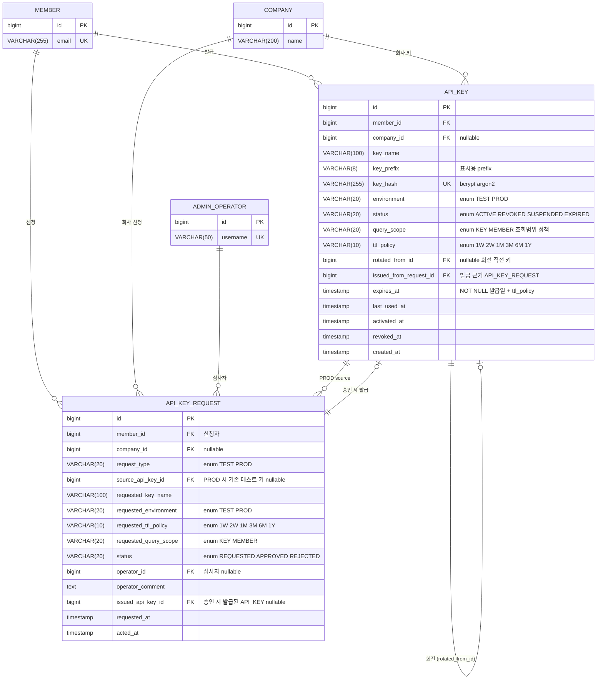
```mermaid
%%{init: {"themeVariables": {"fontSize": "16px"}}}%%
erDiagram
  MEMBER {
    bigint id PK
    VARCHAR(255) email UK
  }
  COMPANY {
    bigint id PK
    VARCHAR(200) name
  }
  ADMIN_OPERATOR {
    bigint id PK
    VARCHAR(50) username UK
  }
  API_KEY {
    bigint id PK
    bigint member_id FK
    bigint company_id FK "nullable"
    VARCHAR(100) key_name
    VARCHAR(8) key_prefix "표시용 prefix"
    VARCHAR(255) key_hash UK "bcrypt argon2"
    VARCHAR(20) environment "enum TEST PROD"
    VARCHAR(20) status "enum ACTIVE REVOKED SUSPENDED EXPIRED"
    VARCHAR(20) query_scope "enum KEY MEMBER 조회범위 정책"
    VARCHAR(10) ttl_policy "enum 1W 2W 1M 3M 6M 1Y"
    bigint rotated_from_id FK "nullable 회전 직전 키"
    bigint issued_from_request_id FK "발급 근거 API_KEY_REQUEST"
    timestamp expires_at "NOT NULL 발급일 + ttl_policy"
    timestamp last_used_at
    timestamp activated_at
    timestamp revoked_at
    timestamp created_at
  }
  API_KEY_REQUEST {
    bigint id PK
    bigint member_id FK "신청자"
    bigint company_id FK "nullable"
    VARCHAR(20) request_type "enum TEST PROD"
    bigint source_api_key_id FK "PROD 시 기존 테스트 키 nullable"
    VARCHAR(100) requested_key_name
    VARCHAR(20) requested_environment "enum TEST PROD"
    VARCHAR(10) requested_ttl_policy "enum 1W 2W 1M 3M 6M 1Y"
    VARCHAR(20) requested_query_scope "enum KEY MEMBER"
    VARCHAR(20) status "enum REQUESTED APPROVED REJECTED"
    bigint operator_id FK "심사자 nullable"
    text operator_comment
    bigint issued_api_key_id FK "승인 시 발급된 API_KEY nullable"
    timestamp requested_at
    timestamp acted_at
  }
  MEMBER ||--o{ API_KEY : "발급"
  COMPANY ||--o{ API_KEY : "회사 키"
  MEMBER ||--o{ API_KEY_REQUEST : "신청"
  COMPANY ||--o{ API_KEY_REQUEST : "회사 신청"
  ADMIN_OPERATOR ||--o{ API_KEY_REQUEST : "심사자"
  API_KEY_REQUEST ||--o| API_KEY : "승인 시 발급"
  API_KEY ||--o{ API_KEY_REQUEST : "PROD source"
  API_KEY ||--o| API_KEY : "회전 (rotated_from_id)"
```

- `MEMBER`·`COMPANY`·`ADMIN_OPERATOR` 모두 stub. 정본은 §1.1 / §2.1 / §9.1.
- **발급 흐름** — `API_KEY_REQUEST` 가 신청 큐. 운영자 승인 시점에만 `API_KEY` row INSERT (이때 `key_hash`, `expires_at`, `activated_at` 등 발급 시점 필드가 실제 값으로 채워짐). 거절 시 `API_KEY` 미생성. `API_KEY.status` enum 에 `PENDING` placeholder 없음 — "심사 중이지만 키는 아직 없음" 상태는 `API_KEY_REQUEST.status = REQUESTED` 로 표현.
- `API_KEY_REQUEST.request_type = PROD` 인 경우 `source_api_key_id` 는 운영 전환 대상 테스트 키. 승인 시 새 운영 키가 `API_KEY` 로 INSERT 되고 기존 테스트 키는 별도 정책에 따라 유지/회수.
- `key_hash` UNIQUE — 평문은 발급 직후 1회만 회원에게 노출 후 폐기.
- `issued_from_request_id` — 발급된 키가 어느 신청에서 비롯됐는지 양방향 추적 (`API_KEY_REQUEST.issued_api_key_id` 의 역참조).
- `rotated_from_id` — 키 회전 시 새 키가 이전 키를 가리키는 자기 참조 (체인 추적). 회전은 `API_KEY_REQUEST` 를 거치지 않는 별도 흐름.

### 4.2. 권한·한도·발신번호 제한

발급된 키의 세부 권한 설정 — 12종 스코프 부여 / 키로 발송 가능한 발신번호 화이트리스트 / 일일 발송 한도·테스트 채널별 쿼터.

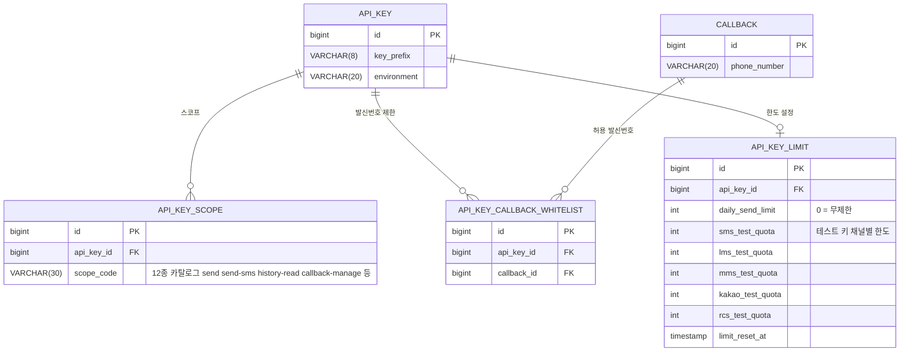
```mermaid
%%{init: {"themeVariables": {"fontSize": "16px"}}}%%
erDiagram
  API_KEY {
    bigint id PK
    VARCHAR(8) key_prefix
    VARCHAR(20) environment
  }
  CALLBACK {
    bigint id PK
    VARCHAR(20) phone_number
  }
  API_KEY_SCOPE {
    bigint id PK
    bigint api_key_id FK
    VARCHAR(30) scope_code "12종 카탈로그 send send-sms history-read callback-manage 등"
  }
  API_KEY_CALLBACK_WHITELIST {
    bigint id PK
    bigint api_key_id FK
    bigint callback_id FK
  }
  API_KEY_LIMIT {
    bigint id PK
    bigint api_key_id FK
    int daily_send_limit "0 = 무제한"
    int sms_test_quota "테스트 키 채널별 한도"
    int lms_test_quota
    int mms_test_quota
    int kakao_test_quota
    int rcs_test_quota
    timestamp limit_reset_at
  }
  API_KEY ||--o{ API_KEY_SCOPE : "스코프"
  API_KEY ||--o{ API_KEY_CALLBACK_WHITELIST : "발신번호 제한"
  API_KEY ||--o| API_KEY_LIMIT : "한도 설정"
  CALLBACK ||--o{ API_KEY_CALLBACK_WHITELIST : "허용 발신번호"
```

- `API_KEY`·`CALLBACK` 모두 stub. 정본은 §4.1 / §3.1.
- `API_KEY_SCOPE.scope_code` — 12종 카탈로그 마스터 테이블 없이 코드 상수로 관리 (불변). 미허용 호출은 `SCOPE_NOT_GRANTED` 403.
- `API_KEY_LIMIT` 는 키당 0~1 행 — 미설정 시 기본 정책 적용.

### 4.3. 호출 이력

SDK/CLI/MCP 모든 진입점의 호출 이력. `wsc.send.sms` 등 도구명 단위 통계 + 응답 시간 + 에러 메시지.

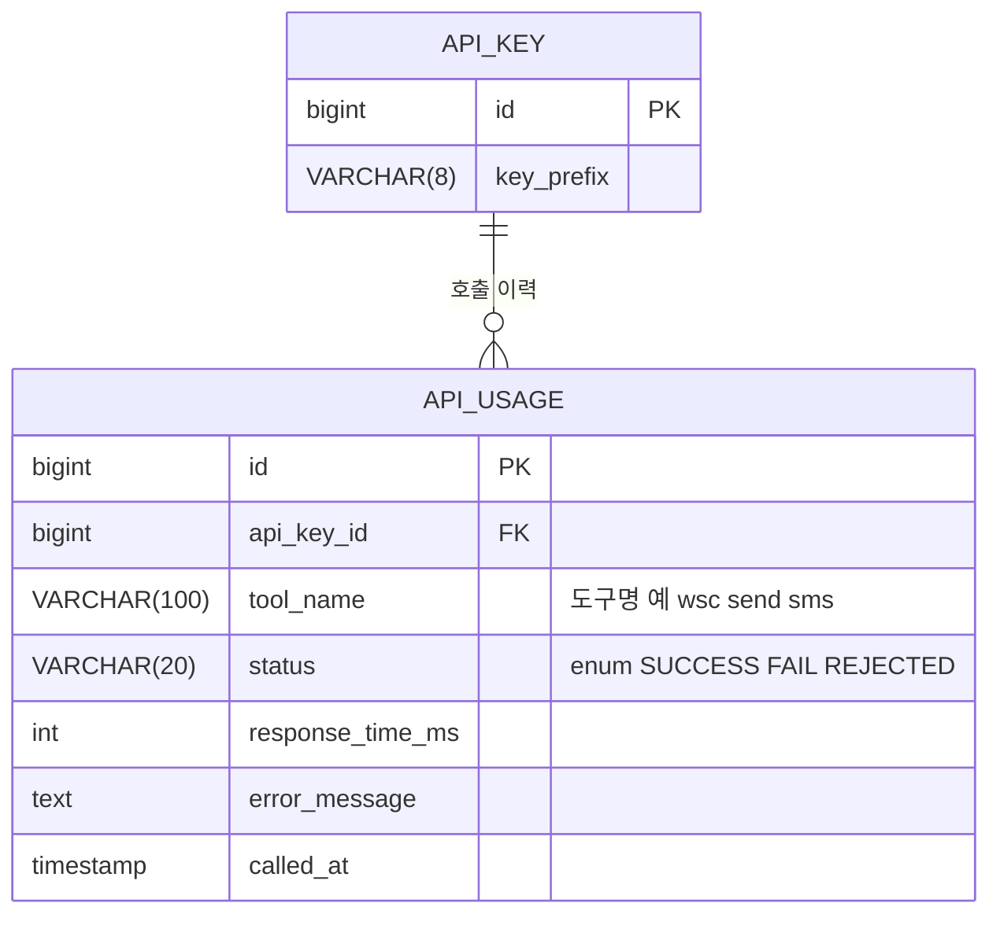
```mermaid
%%{init: {"themeVariables": {"fontSize": "16px"}}}%%
erDiagram
  API_KEY {
    bigint id PK
    VARCHAR(8) key_prefix
  }
  API_USAGE {
    bigint id PK
    bigint api_key_id FK
    VARCHAR(100) tool_name "도구명 예 wsc send sms"
    VARCHAR(20) status "enum SUCCESS FAIL REJECTED"
    int response_time_ms
    text error_message
    timestamp called_at
  }
  API_KEY ||--o{ API_USAGE : "호출 이력"
```

- `API_KEY` 는 stub. 정본은 §4.1.
- 백엔드 기존 엔티티(`backend/.../domain/ApiUsage.java`) 와 호환.
- 인덱스: `(api_key_id, called_at DESC)`. 7일 이상 이력은 콜드 스토리지 이관 검토 (NFR).

### 4.4. 노트

- `API_KEY.environment = TEST` 인 키로 상용 발송 적재 시도 시 `403 ENV_MISMATCH` (`04_PROJECT_PLAN W-205`).
- 키 폐기·재발급 시 모든 노드 캐시 1초 내 무효화 — Redis pub/sub `keyrevoke` 채널 발행 (`02_FEATURE_SPEC §5.4`).

#### 만료(expires_at) 정책

- **발급 시 회원이 TTL 선택** — `ttl_policy ∈ {1W, 2W, 1M, 3M, 6M, 1Y}` 6종 중 선택. **무기한 옵션 없음** — 모든 키는 유한 수명. 백엔드가 선택값에 따라 `expires_at = NOW() + 기간` 계산해 NOT NULL 로 저장.
- **운영자 강제 상한** — 키 환경별 허용 옵션 운영자 정책으로 제한:
  - 테스트 키: `{1W, 2W, 1M}` 만 허용 (보안 사고 영향 최소화)
  - 운영 키: `{1M, 3M, 6M, 1Y}` 허용
  - 미허용 옵션 발급 신청 시 단계에서 거부
- **인증 시점 만료 검사** — `status = ACTIVE` + `expires_at > NOW()`. 만료 시 `401 KEY_EXPIRED` + `status` 를 `EXPIRED` 로 자동 마킹.
- **Redis 캐시 TTL** — `auth:apikey:{hash}` 캐시는 `min(10분, expires_at - NOW())` 로 설정. 캐시가 만료를 넘기지 않게.
- **만료 임박 알림** — 7일 전 + 1일 전 이메일·인앱 알림 (디바운스 키 `alert:keyexpiry:{apiKeyId}` Redis 사용).
- **키 회전 (Rotation)** — 회원이 `/keys/{id}/rotate` 클릭 시:
  1. 동일 `scopes` / `callback_whitelist` / `environment` / `limits` 로 새 `API_KEY` 발급 (새 `ttl_policy` 선택)
  2. 새 키의 `rotated_from_id` = 기존 키 id
  3. 기존 키 즉시 `status = REVOKED` 전이 + Redis pub/sub `keyrevoke` 발행
  4. 회원에게 새 평문 키 1회 노출 + 기존 키 사용 중인 클라이언트는 새 키로 즉시 교체 안내
- **운영자 강제 단축** — 보안 사고 시 운영자가 `expires_at` 을 즉시 단축 가능 (`AUDIT_LOG` 기록 필수).

---

## 5. 메시지 발송 (외부 시스템 인터페이스)

발송 적재·송출·결과 기록 테이블은 **외부 발송 시스템** 이 소유·운영한다. 본 ERD 의 정의 범위에 들어가지 않으며, 본 서비스는 외부 스키마에 INSERT 하고 결과를 SELECT 한다. 단건/다건/예약 모두 동일한 테이블에 `request_date` 를 다르게 넣어 INSERT 한다.

본 서비스가 책임지는 것은 다음 3 단계로 한정:

1. **적재 전 검증** — KISA 등록 발신번호 / API Key 스코프 / 일일 한도 / 잔액 / 스팸 키워드 / 광고 의무 표기 / 채널 길이 / 카카오 템플릿 승인 등 (`02_FEATURE_SPEC §6.1·§11`)
2. **외부 테이블 INSERT** — 검증 통과 시 외부 시스템 스키마로 INSERT (`message_state = 0`). 외부 시스템이 `request_date` 도래 시점에 자동 송출
3. **결과 조회** — 외부 진행·로그 테이블 SELECT (`message_state`, `result_code`, `result_deliver_date`, `result_net_id`). 회원 이력 화면(`/histories`) 에 표시

### 5.1. 외부 발송 테이블 패밀리

채널 4종 × (진행 / 월별 로그) 2종 = **8 패밀리**. 모든 패밀리는 동일한 컬럼 셋을 공유하고, 각 컬럼에 어떤 값을 채울지·어떤 의미로 해석할지는 **외부 발송 시스템 책임** — 본 서비스는 컬럼명·타입·INSERT 입력값 산출만 담당한다.

| 채널 | 진행 테이블 (active) | 로그 테이블 (월별) |
|------|----------------------|---------------------|
| SMS | `send_sms_tran` | `send_sms_log_YYYYMM` |
| MMS | `send_mms_tran` | `send_mms_log_YYYYMM` |
| 카카오 | `send_kko_tran` | `send_kko_log_YYYYMM` |
| RCS | `send_rcs_tran` | `send_rcs_log_YYYYMM` |

진행·로그 테이블은 컬럼 셋은 동일하고, PK·인덱스만 다음과 같이 다르다:

| 구분 | 진행 (`_tran`) | 로그 (`_log_YYYYMM`) |
|------|----------------|----------------------|
| PRIMARY KEY | `msg_id BIGINT AUTO_INCREMENT` | 없음 (PK 미정의) |
| 인덱스 | `idx_fetch (message_state, request_date, msg_type)` | `idx_user (user_id, group_id)`, `idx_request_date (request_date, msg_type)` |
| 용도 | 외부 시스템의 송출 큐 fetch 대상 | 월별 RANGE 분할 — 회원 이력 조회 대상 |

### 5.2. 공통 컬럼 명세

엔진/문자셋은 외부 운영 DB 기준 `InnoDB / utf8mb4 / utf8mb4_unicode_ci`. 컬럼 셋은 4 채널 공통이며, 채널별로 어떤 컬럼에 어떤 값을 어떤 의미로 채울지는 외부 시스템이 결정한다.

| 컬럼 | 타입 | NULL | 비고 (외부 시스템 정의) |
|------|------|------|------------------------|
| `msg_id` | BIGINT | NOT NULL | 메시지 ID (`_tran` AUTO_INCREMENT, `_log` 는 동일 값 복사) |
| `msg_type` | VARCHAR(4) | NOT NULL | 메시지 유형 |
| `msg_sub_type` | VARCHAR(5) | NOT NULL | 메시지 세부 유형 |
| `group_id` | INT | NULL | 전송 그룹 ID (일괄 발송 묶음) |
| `user_id` | VARCHAR(32) | NULL | 발송 사용자 ID |
| `kisa_code` | VARCHAR(20) | NULL | KISA 식별 코드 |
| `destaddr` | VARCHAR(32) | NOT NULL | 착신 번호 |
| `callback` | VARCHAR(32) | NOT NULL | 회신 번호 (발신번호) |
| `bill_code` | VARCHAR(30) | NULL | 과금 코드 |
| `subject` | VARCHAR(120) | NULL | 메시지 제목 |
| `send_msg` | TEXT | NULL | 메시지 내용 |
| `sender_key` | VARCHAR(40) | NOT NULL | 카카오 발신프로필 키 |
| `template_code` | VARCHAR(50) | NULL | 카카오 템플릿 코드 |
| `attach_data` | TEXT | NULL | 첨부 데이터 (이미지·버튼·확장 JSON 문자열) |
| `fb_type` | VARCHAR(5) | NULL | 대체발송 유형 (`SMS` / `LMS` / `MMS`). 없으면 NULL |
| `fb_subject` | VARCHAR(120) | NULL | 대체발송 제목 |
| `fb_msg` | TEXT | NULL | 대체발송 내용 |
| `fb_file_count` | TINYINT | NULL | 대체발송 첨부파일 개수 (기본 0) |
| `fb_file_path` | VARCHAR(255) | NULL | 대체발송 첨부파일 경로 |
| `fb_msg_id` | BIGINT | NULL | 대체발송 메시지 ID |
| `message_state` | TINYINT | NOT NULL | 메시지 상태 (기본 0). §5.3 카탈로그 |
| `retry_count` | TINYINT | NULL | 재시도 횟수 (기본 0) |
| `create_date` | DATETIME | NOT NULL | 메시지 생성 일시 (DEFAULT `CURRENT_TIMESTAMP`) |
| `update_date` | DATETIME | NOT NULL | 메시지 상태 수정 일시 (DEFAULT `CURRENT_TIMESTAMP`) |
| `request_date` | DATETIME | NOT NULL | 메시지 전송 희망 일시 (예약 발송은 미래 시각) |
| `result_deliver_date` | DATETIME | NULL | 통신사 처리 일시 |
| `result_code` | VARCHAR(5) | NULL | 전송 처리 결과 코드 |
| `result_net_id` | VARCHAR(4) | NULL | 착신 통신사 |
| `etc_char_1` ~ `etc_char_4` | VARCHAR(100) | NULL | 예비 문자열 컬럼 4종 |
| `etc_int_5` ~ `etc_int_8` | INT | NULL | 예비 정수 컬럼 4종 |

- 본 서비스는 INSERT 시점에 위 컬럼 중 외부 시스템과 합의된 입력 컬럼만 채우고 송출·상태 전이·`result_*` 채움은 모두 외부 시스템이 수행한다.
- 예비 컬럼(`etc_char_*`, `etc_int_*`) 의 사용 여부·의미는 외부 시스템 합의에 따른다.

### 5.3. `message_state` 카탈로그

| 값 | 코드 | 설명 | 보유 테이블 |
|----|------|------|-------------|
| 0 | `init` | 입력 초기 — 본 서비스가 INSERT 직후 | `_tran` |
| 1 | `fetched` | 외부 시스템이 송출 큐로 가져감 | `_tran` |
| 2 | `submitted` | 외부 시스템 송출 성공 | `_tran` |
| 3 | `finished` | 처리 완료 — 로그 테이블 이관 대상 | `_tran` → `_log_YYYYMM` |
| 4 | `logfail` | 로그 이관 실패 — 외부 운영자 점검 대상 | `_tran` |

- 본 서비스의 INSERT 는 항상 `message_state = 0`. 1~4 상태 전이와 `_tran` → `_log_YYYYMM` 이관은 외부 시스템 책임.
- 회원 이력 화면은 `_tran` + 조회 기간이 포함하는 `_log_YYYYMM` 들을 UNION 조회한다 (예: 최근 60일 조회 시 `_tran` + 당월 `_log_YYYYMM` + 전월 `_log_YYYYMM`).

### 5.4. 우리 책임 범위

본 서비스가 자체적으로 보유·관리하는 데이터:

- **적재 입력값 계산** — `msg_type` · `callback` · `destaddr` · `send_msg` · `request_date` · (카카오) `sender_key` / `template_code` · (RCS·카카오) `fb_*` 폴백 페이로드. 우리 도메인 데이터(§3 발신번호 / §4 API Key / §6 카카오·RCS / §7 결제 잔액) 조회·검증으로 산출
- **잔액 차감** — 검증 통과 후 외부 INSERT 직전에 `CHARGE_BALANCE` 차감 (§7). 차감 트랜잭션 커밋 후 외부 INSERT
- **외부 적재 실패 시 보상** — 외부 INSERT 실패 응답 시 `CHARGE_BALANCE_LEDGER` REVERT 행 INSERT (보상 트랜잭션)
- **API 호출 이력** — 외부 적재 요청·응답을 `API_USAGE` 에 기록 (§4)
- **결과 조회 캐시** (옵션) — 자주 조회되는 결과는 Redis `send:result:{msg_id}` 단기 캐시 (5분 검토)

### 5.5. 노트

- **단건 = 다건 = 예약** — `_tran` 1행/N행/미래 `request_date` 로만 구분. 별도 BATCH 작업 테이블 불필요. 일괄 발송은 동일 `group_id` 를 공유한다.
- **대체발송 (`fb_*`)** — 카카오·RCS 채널 INSERT 시 폴백용 SMS/LMS/MMS 페이로드를 같은 행에 동봉. 외부 시스템이 1차 송출 실패 시 `fb_*` 로 자동 폴백하고 `fb_msg_id` 를 발급한다.
- **routing_meta 회원 비노출** — 중계사 매핑값(LG CNS/KT/인포뱅크)은 외부 시스템이 컬럼(`etc_*` 등)으로 처리하며, 본 서비스 응답·UI·이력 어디에도 노출하지 않는다 (INV-02, `01_PRD` 차별화 ②).
- **잔액 부족 분기** — `BALANCE` 검증 실패 시 자동충전 → 후불 → 부분 발송 분기 (`02_FEATURE_SPEC §11`). 적재된 건은 외부 시스템에서 완주, 거부된 건만 회원에게 보고.
- **결과 조회 패턴** — 회원 이력 화면(`/histories`)·CLI(`wsc history list`)·MCP(`wsc.history.list`) 모두 외부 `_tran` + `_log_YYYYMM` SELECT. 조회 범위 정책(`scope:key` / `scope:member`)은 §4 `API_KEY.query_scope` 로 분기.

### 5.6. 검증 캐시 Redis 키

발송 hot path 가속용 캐시는 우리가 소유:

| 캐시 | Redis 키 | TTL | 용도 |
|------|----------|-----|------|
| KISA 등록 여부 | `kisa:cache:{phone}` | 10분 | 검증 1단계 |
| 카카오 템플릿 승인 여부 | `tmpl:approved:{memberId}:{templateCode}` | 10분 | 검증 카카오 채널 |
| 라우팅 매핑 | `routing:{memberId}` | 10분 | 외부 INSERT 시 routing_meta 산출 |
| 잔액 합계 | `balance:{memberId}` | 30초 | 검증 잔액 조회 |
| 발송 Rate Limit | `ratelimit:send:{apiKeyId}` | 슬라이딩 60초 | 검증 RL |
| 일일 발송 한도 | `quota:daily:{apiKeyId}:{yyyymmdd}` | 익일 0시 | 검증 일일 한도 |
| 결과 조회 캐시 (옵션) | `send:result:{msg_id}` | 5분 | 자주 조회 결과 |

---

## 6. 카카오·RCS 템플릿·브랜드·라우팅 (외부 시스템 인터페이스)

카카오 알림톡 템플릿·심사·이력, RCS 템플릿·양식·컴포넌트·이력, 중계사 라우팅 매핑 — 모두 **외부 발송 시스템** 이 소유한 테이블에서 처리된다. §5 메시지 발송과 동일하게 본 ERD 정의 범위 외이며, 본 서비스는 외부 스키마를 SELECT/JOIN 으로 조회해 발송 검증 게이트와 회원 화면(`/templates/kakao`·`/templates/rcs`) 에 사용한다.

본 서비스의 책임은 다음 2 단계로 한정:

1. **발송 검증 게이트** — 외부 시스템에서 카카오 템플릿 승인 상태·RCS 템플릿 승인 상태를 조회해 발송 가능 여부 판정
2. **결과 조회 캐시** — 자주 조회되는 승인 상태는 Redis 캐시로 hot path 가속

엔진/문자셋은 외부 운영 DB 기준 `InnoDB / utf8mb4 / utf8mb4_unicode_ci` (일부 컬럼은 `utf8mb4_general_ci`). 컬럼 의미·검수 상태 카탈로그는 외부 시스템이 정의하며 본 절은 컬럼명·타입·주석을 기재만 한다.

### 6.1. 카카오 알림톡 외부 테이블 패밀리

| 테이블 | 한글명 | PK | 참조 |
|--------|--------|----|------|
| `kko_brand_template` | 카카오 브랜드(채널) 템플릿 | `no BIGINT AUTO_INCREMENT` | FK `kko_profile_no` → `kko_profile.no` ON UPDATE CASCADE |
| `kko_template` | 카카오 템플릿 관리 (마스터) | `no INT AUTO_INCREMENT` | UQ `KKO_TEMPLATE_UNQ (template_code, kko_profile_no)` |
| `kko_template_category` | 카카오 템플릿 카테고리 (CENTER API 갱신) | `(code_m, code_s)` | — |
| `kko_template_history` | 카카오 템플릿 변경 이력 | `no INT AUTO_INCREMENT` | `kko_template_no` (FK 컬럼) |

#### 6.1.1. `kko_brand_template` 컬럼

| 컬럼 | 타입 | NULL | 비고 |
|------|------|------|------|
| `no` | BIGINT | NOT NULL | AUTO_INCREMENT, PK |
| `kko_profile_no` | INT | NULL | FK → `kko_profile.no` |
| `code` | VARCHAR(255) | NULL | — |
| `name` | VARCHAR(255) | NULL | — |
| `chat_bubble_type` | CHAR(30) | NULL | — |
| `content` | VARCHAR(1300) | NULL | — |
| `adult` | CHAR(1) | NULL | Y/N |
| `image_link` | VARCHAR(1000) | NULL | — |
| `image_url` | VARCHAR(1000) | NULL | — |
| `header` | VARCHAR(1000) | NULL | — |
| `additional_content` | TEXT | NULL | — |
| `carousel` | TEXT | NULL | — |
| `wide_item_list` | TEXT | NULL | — |
| `video` | TEXT | NULL | — |
| `commerce` | TEXT | NULL | — |
| `sys_create_date` | DATETIME | NULL | — |
| `sys_update_date` | DATETIME | NULL | — |
| `status` | CHAR(1) | NULL | A: 등록, S: 차단, D: 삭제, T: 임시저장 |
| `buttons` | TEXT | NULL | — |
| `coupon` | TEXT | NULL | — |

- 인덱스: `idx_kko_brand_template_kko_profile_no (kko_profile_no)`

#### 6.1.2. `kko_template` 컬럼

| 컬럼 | 타입 | NULL | 비고 |
|------|------|------|------|
| `no` | INT | NOT NULL | AUTO_INCREMENT, PK — KKO_TEMPLATE 인덱스 |
| `kko_profile_no` | INT | NULL | 발신프로필 관리 테이블 인덱스 (FK) |
| `category_code` | CHAR(6) | NULL | 템플릿 카테고리 |
| `template_code` | VARCHAR(30) | NOT NULL | 템플릿 코드 |
| `template_name` | VARCHAR(200) | NULL | 템플릿명 |
| `status` | CHAR(1) | NULL | 템플릿 상태 (WISE, INFO — S:중단, A:정상, R:대기(발송전) / 타사 없음) |
| `comments` | VARCHAR(3000) | NULL | 검수결과 댓글 리스트 (JSON) |
| `template_message_type` | CHAR(2) | NULL | 메시지 유형 (BA: 기본형_default, EX: 부가 정보형, AD: 광고 추가형, MI: 복합형) |
| `template_emphasize_type` | VARCHAR(10) | NULL | 강조 유형 (NONE: 선택안함_default, TEXT: 강조표기형, IMAGE: 이미지형, ITEM_LIST: 아이템리스트형) |
| `template_content` | VARCHAR(3000) | NULL | 템플릿 내용 |
| `buttons` | VARCHAR(2000) | NULL | 버튼 Data (JSON) |
| `quick_replies` | VARCHAR(1000) | NULL | 바로 연결 정보 — 상담톡 채널옵션 (JSON) |
| `security_flag` | CHAR(1) | NULL | DEFAULT '0'. 보안 템플릿 (0: 미설정_default, 1: 설정) |
| `inspection_status` | CHAR(7) | NULL | 검수 상태 (REG: 등록, REQ: 검수요청, APR: 승인, REJ: 반려) |
| `use_flag` | CHAR(1) | NULL | DEFAULT 'Y'. 사용 여부 (Y: 사용_default, N: 사용중지, D: 삭제) |
| `block` | CHAR(1) | NULL | DEFAULT '0'. 템플릿 차단 (0: 해제_default, 1: 차단) |
| `dormant` | CHAR(1) | NULL | DEFAULT '0'. 휴면 여부 (0: 미설정, 1: 설정) |
| `sys_create_date` | TIMESTAMP | NULL | DEFAULT `CURRENT_TIMESTAMP`. 등록일 |
| `sys_create_id` | VARCHAR(16) | NULL | 등록자 |
| `sys_update_date` | TIMESTAMP | NULL | 수정일 |
| `sys_update_id` | VARCHAR(16) | NULL | 수정자 |
| `template_extra` | VARCHAR(1500) | NULL | 메시지유형 Data — 부가정보 (EX, MI) |
| `template_ad` | VARCHAR(1000) | NULL | 메시지유형 Data — 수신동의요청/광고문구 (AD, MI) |
| `template_title` | VARCHAR(100) | NULL | 강조 제목 (TEXT) |
| `template_subtitle` | VARCHAR(100) | NULL | 강조 보조 (TEXT) |
| `template_image_name` | VARCHAR(150) | NULL | 이미지 파일명 (IMAGE, ITEM_LIST) |
| `template_image_url` | VARCHAR(500) | NULL | 이미지 URL (IMAGE, ITEM_LIST) |
| `template_header` | VARCHAR(100) | NULL | 헤더 (ITEM_LIST) |
| `template_item_highlight` | VARCHAR(300) | NULL | 아이템 하이라이트 (ITEM_LIST) `{title, description, imageUrl}` |
| `template_item` | VARCHAR(3000) | NULL | 아이템 리스트 (ITEM_LIST) `{list:[{title, description}], summary:{title, description}}` |
| `agency_template_code` | VARCHAR(30) | NULL | 대행사 사용 템플릿 코드 |

#### 6.1.3. `kko_template_category` 컬럼

| 컬럼 | 타입 | NULL | 비고 |
|------|------|------|------|
| `code_m` | CHAR(3) | NOT NULL | 카테고리 마스터 코드, PK 부분 |
| `code_s` | CHAR(3) | NOT NULL | 카테고리 서브 코드, PK 부분 |
| `code_name` | VARCHAR(30) | NULL | 카테고리 이름 |
| `group_name` | VARCHAR(30) | NULL | 카테고리 그룹 이름 |
| `inclusion` | VARCHAR(300) | NULL | 적용 대상 템플릿 설명 |
| `exclusion` | VARCHAR(300) | NULL | 제외 대상 템플릿 설명 |
| `sys_update_date` | TIMESTAMP | NULL | 수정일자 (CENTER API 갱신) |

#### 6.1.4. `kko_template_history` 컬럼

`kko_template` 와 동일 컬럼 셋을 가지며 다음만 다르다:

| 컬럼 | 타입 | NULL | 비고 |
|------|------|------|------|
| `no` | INT | NOT NULL | AUTO_INCREMENT, PK — KKO_TEMPLATE_HISTORY 인덱스 |
| `kko_template_no` | INT | NULL | 카카오 템플릿 관리 테이블 인덱스 (FK 컬럼) |
| `kko_profile_no` | INT | NULL | 발신프로필 관리 테이블 인덱스 (FK 컬럼) |
| `template_name` | VARCHAR(90) | NULL | (마스터의 200 → 이력에선 90 으로 단축) |

이외 컬럼(`category_code` ~ `agency_template_code`) 은 §6.1.2 와 동일 정의를 따른다.

### 6.2. RCS 외부 테이블 패밀리

| 테이블 | 한글명 | PK | 참조 |
|--------|--------|----|------|
| `rcs_template` | RCS 템플릿 관리 | `no INT AUTO_INCREMENT` | IDX `RCS_TEMPLATE_brand_id (brand_id)`, `RCS_TEMPLATE_brand_id_messagebase_id (brand_id, messagebase_id)` |
| `rcs_template_component` | RCS 템플릿 컴포넌트 (관리자 직접 입력) | `id VARCHAR(10)` | — |
| `rcs_template_form` | RCS 템플릿 양식 | `messagebaseform_id VARCHAR(40)` | `component_id` → `rcs_template_component.id` (직접 매칭) |
| `rcs_template_hist` | RCS 템플릿 이력 | `no INT AUTO_INCREMENT` | — |

#### 6.2.1. `rcs_template` 컬럼

| 컬럼 | 타입 | NULL | 비고 |
|------|------|------|------|
| `no` | INT | NOT NULL | AUTO_INCREMENT, PK |
| `messagebase_id` | VARCHAR(40) | NOT NULL | RCS 템플릿 ID |
| `group_id` | VARCHAR(40) | NULL | 대량 등록된 경우 그룹 ID |
| `template_name` | VARCHAR(40) | NULL | RCS 등록 시 입력된 템플릿 명칭 |
| `messagebaseform_id` | VARCHAR(40) | NULL | 양식 ID (DDL 주석 원문: "RCS 등록시 입력된 템플릿 명칭") |
| `brand_id` | VARCHAR(13) | NULL | RCS 브랜드 ID (공통 템플릿인 경우 `COMMON`) |
| `status` | VARCHAR(10) | NULL | `ready`: 사용 / `pause`: 사용중지 |
| `approval_result` | VARCHAR(20) | NULL | 승인 상태 — 저장, 승인대기, 검수시작, 승인, 반려, 검수완료, 승인대기(수정), 검수시작(수정), 반려(수정), 검수완료(수정) |
| `approval_reason` | VARCHAR(400) | NULL | 승인 사유 |
| `register_date` | DATETIME | NULL | 등록 일시 |
| `approval_date` | DATETIME | NULL | 승인 일시 |
| `update_date` | DATETIME | NULL | 수정 일시 |
| `product_code` | VARCHAR(10) | NULL | 메시지 상품 종류 (`sms`, `lms`, `mms`, `tmplt`) |
| `spec` | VARCHAR(20) | NULL | 레이아웃 구조 (`RICHCARD`, `OPENRICHCARD`) |
| `card_type` | VARCHAR(64) | NULL | 카드 종류 (`standalone`, `standalone horizontal`, `Thumbnail`, `SNS` 등) |
| `agency_id` | VARCHAR(20) | NULL | 등록 대행사 ID |
| `input_text` | VARCHAR(300) | NULL | 정보성 텍스트 템플릿 서술(Description) 원본 문장 |
| `params` | TEXT | NULL | 개별 파라미터 검수 대상 정보 객체 — 크기 필드 ≤ 0 이면 미체크 |
| `formatted_string` | TEXT | NULL | GSMA / TTA RCS 규격 JSON 레이아웃 |
| `created_type` | TINYINT | NULL | 0: 관리자, 1: 사용자, 2: RBC |
| `is_delete` | CHAR(1) | NULL | DEFAULT 'N'. RBC 반영 후 미사용 처리 (보낸내역 조회 용도) |
| `sys_create_date` | TIMESTAMP | NULL | DEFAULT `CURRENT_TIMESTAMP`. 자체 web 등록일 |
| `sys_create_id` | VARCHAR(20) | NULL | 자체 web 등록 ID |
| `sys_update_date` | TIMESTAMP | NULL | DEFAULT `CURRENT_TIMESTAMP`. 수정일 |
| `sys_update_id` | VARCHAR(20) | NULL | 수정 ID |

#### 6.2.2. `rcs_template_component` 컬럼

| 컬럼 | 타입 | NULL | 비고 |
|------|------|------|------|
| `id` | VARCHAR(10) | NOT NULL | PK |
| `name` | VARCHAR(50) | NULL | — |
| `product` | CHAR(1) | NULL | — |
| `form_id` | VARCHAR(30) | NULL | 대표 form id |
| `image_url` | VARCHAR(200) | NULL | 예시 이미지 |
| `sort_order` | TINYINT | NULL | 정렬 순서 |

#### 6.2.3. `rcs_template_form` 컬럼

| 컬럼 | 타입 | NULL | 비고 |
|------|------|------|------|
| `messagebaseform_id` | VARCHAR(40) | NOT NULL | 템플릿 양식 ID, PK |
| `name` | VARCHAR(40) | NULL | 양식명 |
| `card_type` | VARCHAR(64) | NULL | Description, Cell, Free |
| `biz_condition` | VARCHAR(60) | NULL | (JSON) 양식 사용 가능 업태 목록 |
| `biz_category` | VARCHAR(20) | NULL | Description, Cell 유형 그룹 |
| `biz_service` | VARCHAR(20) | NULL | Description, Cell 세부 유형 |
| `register_date` | DATETIME | NULL | 양식 등록 일시 |
| `update_date` | DATETIME | NULL | 양식 수정 일시 |
| `media_url` | VARCHAR(1000) | NULL | (JSON) 이미지 파일 ID + URL + 사용 유형 |
| `product_code` | VARCHAR(10) | NULL | `sms`, `lms`, `mms`, `tmplt` |
| `spec` | VARCHAR(15) | NULL | `richard`, `openrichard` |
| `guide_info` | TEXT | NULL | (JSON) 가이드 정보 |
| `policy_info` | VARCHAR(300) | NULL | (JSON) 리치카드/오픈리치카드 content 검증 정책 |
| `params` | TEXT | NULL | (JSON) 개별 파라미터 정보 객체 |
| `formatted_string` | TEXT | NULL | (JSON) 양식 레이아웃 객체 |
| `component_id` | VARCHAR(10) | NULL | `rcs_template_component.id` 직접 매칭 |
| `use_yn` | CHAR(1) | NULL | DEFAULT 'N'. 사용 여부 |

#### 6.2.4. `rcs_template_hist` 컬럼

| 컬럼 | 타입 | NULL | 비고 |
|------|------|------|------|
| `no` | INT | NOT NULL | AUTO_INCREMENT, PK |
| `messagebase_id` | VARCHAR(40) | NULL | 템플릿 ID |
| `template_name` | VARCHAR(40) | NULL | 템플릿 명칭 |
| `brand_id` | VARCHAR(13) | NULL | — |
| `status` | VARCHAR(10) | NULL | — |
| `approval_result` | VARCHAR(20) | NULL | — |
| `reg_id` | VARCHAR(16) | NULL | 등록자 ID |
| `reg_date` | DATETIME | NULL | DEFAULT `CURRENT_TIMESTAMP` |
| `history_type` | VARCHAR(10) | NULL | 등록, 수정, 삭제 |
| `created_type` | TINYINT | NULL | 0: 관리자, 1: 사용자, 2: RBC |

### 6.3. 우리 책임 범위

본 서비스가 자체적으로 보유·관리하는 데이터:

- **승인 상태 조회 캐시** — Redis `tmpl:approved:{memberId}:{templateCode}` 로 외부 결과 단기 캐싱 (TTL 10분)
- **라우팅 조회 캐시** — Redis `routing:{memberId}` 로 회원별 중계사 매핑 캐싱 (TTL 10분)
- **외부 호출 API 이력** — `API_USAGE` 에 외부 시스템 호출 통계 (§4.3)

본 서비스가 보유하지 않는 것:
- 카카오 템플릿 마스터·이력·카테고리·브랜드 본문 (외부 `kko_*` 4종)
- RCS 템플릿 마스터·양식·컴포넌트·이력 본문 (외부 `rcs_template*` 4종)
- 카카오 템플릿 이관 큐 (외부 또는 운영자 수동 처리)
- 중계사 라우팅 매핑 본 (외부 또는 운영자 콘솔)

### 6.4. 발송 검증 게이트 흐름

```
① 발송 요청 도착
② Redis GET tmpl:approved:{memberId}:{templateCode}
   - HIT (status='APPROVED') → 검증 통과
   - HIT (status≠'APPROVED' 또는 미존재) → 거부
   - MISS → 외부 시스템 API 호출 (카카오: kko_template.inspection_status='APR' AND status='A'
                                  / RCS: rcs_template.approval_result='승인' AND status='ready')
            결과를 Redis 캐시 적재
③ RCS 채널이면 Redis GET routing:{memberId} 도 함께 확인
④ 검증 통과 시 외부 적재 테이블 INSERT (§5.1)
```

### 6.5. 노트

- 카카오 템플릿 상태 변경 시 외부 시스템이 pub/sub 또는 webhook 으로 우리 캐시에 무효화 신호 전송 검토 (구현 시 합의).
- 회원에게 절대 노출 X — 라우팅 매핑(중계사 정보)은 외부 시스템 컬럼에만 기록, 본 서비스 응답·UI·CLI·MCP 어디에도 나타나지 않음 (INV-02).
- `kko_template_category` 는 CENTER API 로 갱신되는 메타. 본 서비스는 SELECT 만 한다.
- `kko_template_history` / `rcs_template_hist` 는 외부 시스템 측 변경 이력 — 본 서비스의 `AUDIT_LOG` (§9) 와 별개.

---

## 7. 결제·캐시·후불·환불

결제 도메인은 회계 진실 원천이라 가장 큰 도메인. 흐름이 6 갈래라 sub-ERD 분할:

- **§7.1 결제수단·충전** — `/billing/charge` 화면
- **§7.2 충전 잔액·차감** — 발송 시 FIFO 차감
- **§7.3 자동충전** — `/billing/auto-charge`
- **§7.4 후불 (사업자)** — `/billing/postpaid`
- **§7.5 환불·현금영수증** — `/billing/refunds`, `/billing/tax`
- **§7.6 잔액 임계 알림** — 잔액 임계 도달 시 알림

| 테이블 | 한글명 | 저장소 | 정본 위치 | 역할 한 줄 |
|--------|--------|--------|-----------|------------|
| `PAYMENT_METHOD` | 등록 결제수단 | RDB | §7.1 | 7종 결제수단 + PG 빌키 |
| `CHARGE` | 충전 거래 | RDB | §7.1 | **회계 진실 원천** — 수동/자동 충전 1건당 1행. status 가 살아 움직임 (REQUESTED → SUCCESS / FAILED / CANCELLED). PG 거래번호 멱등. 단순 이력 아님 — `CHARGE_BALANCE` 의 부모 |
| `CHARGE_BALANCE` | 충전 잔액 (예수금) | **RDB + Redis** | §7.2 | 충전 1건당 잔액 1행 — 결제수단별 분리 + 5년 만료. 잔액 합산 캐시 `balance:{memberId}` |
| `CHARGE_BALANCE_LEDGER` | 충전 잔액 변동 원장 | RDB | §7.2 | 변동 1건당 1행 append-only. ± 부호로 증감 표현. 회계 매출 인식 시점(`reason=SEND`). 발송/조정/만료/환불/REVERT 사유 (FIFO + 만료 임박 우선) |
| `AUTO_CHARGE_CONFIG` | 자동충전 설정 | RDB | §7.3 | 임계치·한도 + PG 30일 갱신 |
| `POSTPAID_CONFIG` | 후불 모델 설정 | RDB | §7.4 | 사업자 한정, 신용 한도·보증보험 |
| `POSTPAID_INVOICE` | 후불 청구서 | RDB | §7.4 | 정산 주기별 청구. `OVERDUE` 시 발송 차단 |
| `REFUND_REQUEST` | 환불 신청 | RDB | §7.5 | 운영자 승인/반려. 5년 경과 불가 |
| `CASH_RECEIPT` | 현금영수증 | RDB | §7.5 | 계좌이체·가상계좌·상품권만 발행. 환불 시 마이너스 정정 |
| `BALANCE_THRESHOLD_ALERT` | 잔액 임계 알림 설정 | RDB | §7.6 | 잔액 임계 미만 시 알림 |

> 결제 도메인은 **회계 진실 원천** — Redis 진실원천 절대 금지. 분산 락·잔액 캐시만 Redis 활용.
>
> 이 도메인의 **Redis 전용 키**: `balance:{memberId}` (잔액 합산 캐시 30초), `lock:auto-charge:{memberId}` (자동충전 중복 실행 방지 30초), `lock:invoice:{companyId}:{period}` (후불 청구서 발행 중복 방지 5분), `alert:fired:{memberId}` (잔액 알림 디바운스 1시간).

### 7.1. 결제수단·충전

회원이 `/billing/charge` 에서 결제수단 등록 후 충전. PG 거래번호 멱등성 보존.

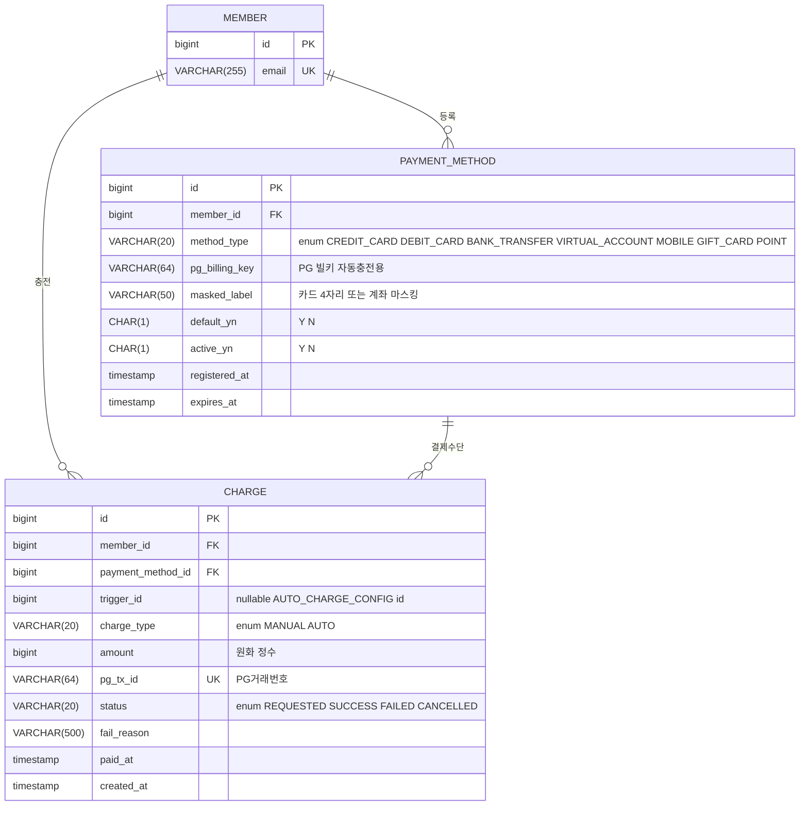
```mermaid
%%{init: {"themeVariables": {"fontSize": "16px"}}}%%
erDiagram
  MEMBER {
    bigint id PK
    VARCHAR(255) email UK
  }
  PAYMENT_METHOD {
    bigint id PK
    bigint member_id FK
    VARCHAR(20) method_type "enum CREDIT_CARD DEBIT_CARD BANK_TRANSFER VIRTUAL_ACCOUNT MOBILE GIFT_CARD POINT"
    VARCHAR(64) pg_billing_key "PG 빌키 자동충전용"
    VARCHAR(50) masked_label "카드 4자리 또는 계좌 마스킹"
    CHAR(1) default_yn "Y N"
    CHAR(1) active_yn "Y N"
    timestamp registered_at
    timestamp expires_at
  }
  CHARGE {
    bigint id PK
    bigint member_id FK
    bigint payment_method_id FK
    bigint trigger_id "nullable AUTO_CHARGE_CONFIG id"
    VARCHAR(20) charge_type "enum MANUAL AUTO"
    bigint amount "원화 정수"
    VARCHAR(64) pg_tx_id UK "PG거래번호"
    VARCHAR(20) status "enum REQUESTED SUCCESS FAILED CANCELLED"
    VARCHAR(500) fail_reason
    timestamp paid_at
    timestamp created_at
  }
  MEMBER ||--o{ PAYMENT_METHOD : "등록"
  MEMBER ||--o{ CHARGE : "충전"
  PAYMENT_METHOD ||--o{ CHARGE : "결제수단"
```

- `MEMBER` 는 stub. 정본은 §1.1.
- `CHARGE.pg_tx_id` UNIQUE — PG 거래번호 멱등성 보장 (중복 콜백 방지).
- 결제수단 7종 — 무통장입금 미지원.
- **billing_mode 제약** — `CHARGE` (수동 충전) 는 **PREPAID 회원 한정**. 개인 회원(`MEMBER.company_id IS NULL`)은 항상 PREPAID. 사업자 회원은 소속 `COMPANY.billing_mode = PREPAID` 일 때만 충전 가능. POSTPAID 회사 멤버는 `/billing/charge` 진입 차단 + 서버 측 INSERT 거부 — 후불 모델이라 선불 캐시 자체가 무의미. 회사 모드 전환 시(`PREPAID → POSTPAID`) 기존 `CHARGE_BALANCE` 잔액은 환불 절차(§7.5) 또는 사용 완료까지 유지.

### 7.2. 충전 잔액·차감 (FIFO + 5년 만료)

충전 1건당 잔액 1행 — 결제수단별 분리된 예수금. 발송 시 만료 임박 + 오래된 행부터 차감 (FIFO).

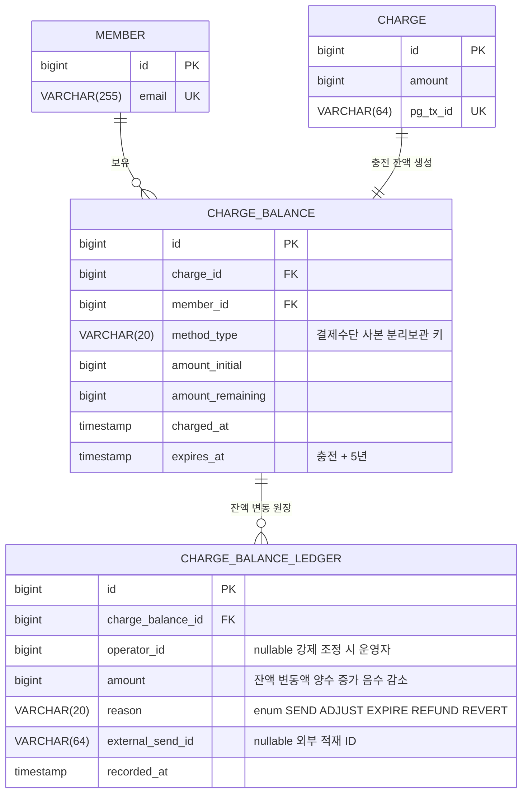
```mermaid
%%{init: {"themeVariables": {"fontSize": "16px"}}}%%
erDiagram
  MEMBER {
    bigint id PK
    VARCHAR(255) email UK
  }
  CHARGE {
    bigint id PK
    bigint amount
    VARCHAR(64) pg_tx_id UK
  }
  CHARGE_BALANCE {
    bigint id PK
    bigint charge_id FK
    bigint member_id FK
    VARCHAR(20) method_type "결제수단 사본 분리보관 키"
    bigint amount_initial
    bigint amount_remaining
    timestamp charged_at
    timestamp expires_at "충전 + 5년"
  }
  CHARGE_BALANCE_LEDGER {
    bigint id PK
    bigint charge_balance_id FK
    bigint operator_id "nullable 강제 조정 시 운영자"
    bigint amount "잔액 변동액 양수 증가 음수 감소"
    VARCHAR(20) reason "enum SEND ADJUST EXPIRE REFUND REVERT"
    VARCHAR(64) external_send_id "nullable 외부 적재 ID"
    timestamp recorded_at
  }
  MEMBER ||--o{ CHARGE_BALANCE : "보유"
  CHARGE ||--|| CHARGE_BALANCE : "충전 잔액 생성"
  CHARGE_BALANCE ||--o{ CHARGE_BALANCE_LEDGER : "잔액 변동 원장"
```

- `MEMBER`·`CHARGE` 모두 stub. 정본은 §1.1 / §7.1.
- **FIFO + 만료 임박 우선** — 차감 후보 LOT 선정 시 `ORDER BY expires_at ASC, charged_at ASC` (`RQ-PAY-013·015`).
- **5년 소멸** — `CHARGE_BALANCE.expires_at = charged_at + 5년`. 만료 임박 사전 안내 후 자동 소멸, `CHARGE_BALANCE_LEDGER(reason=EXPIRE)` 기록.
- **외부 적재 연동** — 발송 차감은 `external_send_id` (외부 시스템 ID) 만 보존. 외부 적재 실패 시 `CHARGE_BALANCE_LEDGER(reason=REVERT)` 보상 행 INSERT (§5.1).

### 7.3. 자동충전

잔액이 임계치 미만 도달 시 PG 정기결제로 자동 충전. PG 30일 제한 갱신 기준.

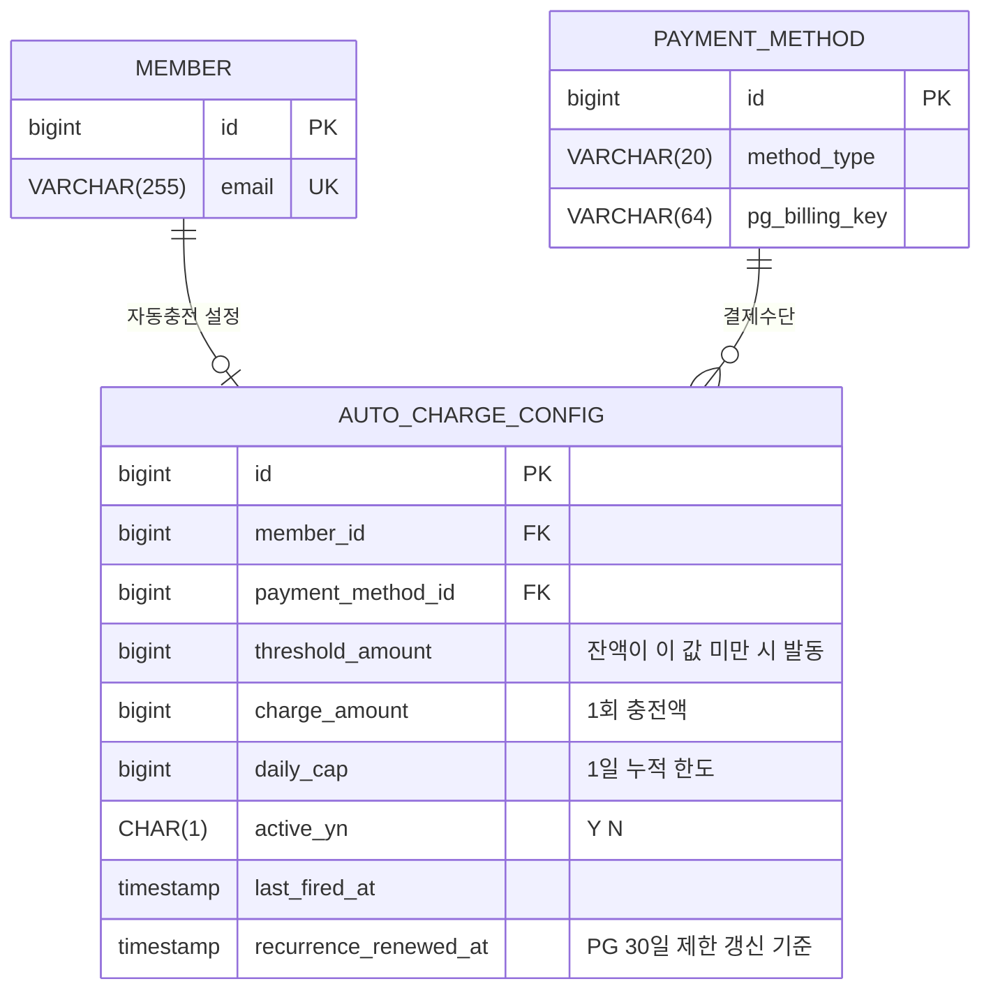
```mermaid
%%{init: {"themeVariables": {"fontSize": "16px"}}}%%
erDiagram
  MEMBER {
    bigint id PK
    VARCHAR(255) email UK
  }
  PAYMENT_METHOD {
    bigint id PK
    VARCHAR(20) method_type
    VARCHAR(64) pg_billing_key
  }
  AUTO_CHARGE_CONFIG {
    bigint id PK
    bigint member_id FK
    bigint payment_method_id FK
    bigint threshold_amount "잔액이 이 값 미만 시 발동"
    bigint charge_amount "1회 충전액"
    bigint daily_cap "1일 누적 한도"
    CHAR(1) active_yn "Y N"
    timestamp last_fired_at
    timestamp recurrence_renewed_at "PG 30일 제한 갱신 기준"
  }
  MEMBER ||--o| AUTO_CHARGE_CONFIG : "자동충전 설정"
  PAYMENT_METHOD ||--o{ AUTO_CHARGE_CONFIG : "결제수단"
```

- `MEMBER`·`PAYMENT_METHOD` 모두 stub. 정본은 §1.1 / §7.1.
- 회원당 0~1 행. 임계 도달 시 분산 락 `lock:auto-charge:{memberId}` (Redis SETNX 30초) 으로 단일 노드만 PG 결제.
- 결과는 `CHARGE` (§7.1) 에 `charge_type=AUTO`, `trigger_id=auto_charge_config_id` 로 INSERT.
- **billing_mode 제약** — 자동충전은 **PREPAID 회원 한정** (수동 충전과 동일 원칙). 사업자 회원은 소속 `COMPANY.billing_mode = PREPAID` 일 때만 등록 가능. POSTPAID 회사 멤버는 `/billing/auto-charge` 진입 차단 + 등록 거부. 회사 모드 전환 시(`PREPAID → POSTPAID`) 기존 활성 row 는 `active_yn = N` 으로 자동 비활성화 + PG 빌키 해지 호출.

### 7.4. 후불 (사업자 한정)

사업자 회원만 운영자 심사 후 후불 활성. 정산 주기별 청구서 발행 + 연체 시 발송 차단.

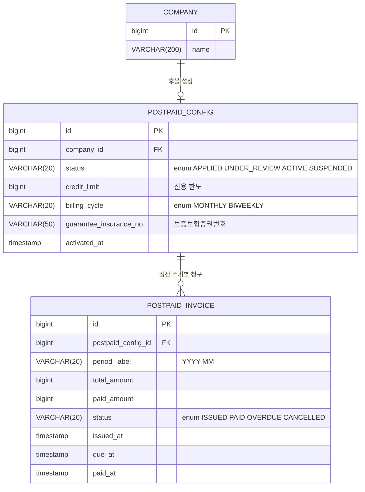
```mermaid
%%{init: {"themeVariables": {"fontSize": "16px"}}}%%
erDiagram
  COMPANY {
    bigint id PK
    VARCHAR(200) name
  }
  POSTPAID_CONFIG {
    bigint id PK
    bigint company_id FK
    VARCHAR(20) status "enum APPLIED UNDER_REVIEW ACTIVE SUSPENDED"
    bigint credit_limit "신용 한도"
    VARCHAR(20) billing_cycle "enum MONTHLY BIWEEKLY"
    VARCHAR(50) guarantee_insurance_no "보증보험증권번호"
    timestamp activated_at
  }
  POSTPAID_INVOICE {
    bigint id PK
    bigint postpaid_config_id FK
    VARCHAR(20) period_label "YYYY-MM"
    bigint total_amount
    bigint paid_amount
    VARCHAR(20) status "enum ISSUED PAID OVERDUE CANCELLED"
    timestamp issued_at
    timestamp due_at
    timestamp paid_at
  }
  COMPANY ||--o| POSTPAID_CONFIG : "후불 설정"
  POSTPAID_CONFIG ||--o{ POSTPAID_INVOICE : "정산 주기별 청구"
```

- `COMPANY` 는 stub. 정본은 §2.1.
- 회사당 0~1 후불 설정. `status=ACTIVE` + `POSTPAID_INVOICE` 미연체 시에만 후불 발송 허용.
- 청구서 발행 중복 방지 — `lock:invoice:{companyId}:{period}` (Redis 5분 락).

### 7.5. 환불·현금영수증

회원이 충전 환불 신청 → 운영자 승인/반려. 결제수단별 환불 라우팅 + 현금영수증 마이너스 정정.

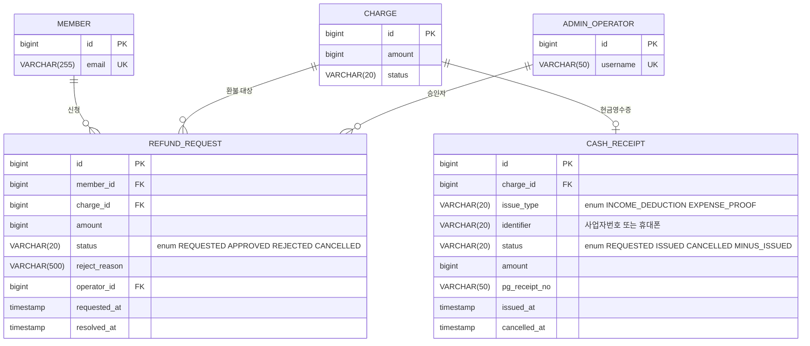
```mermaid
%%{init: {"themeVariables": {"fontSize": "16px"}}}%%
erDiagram
  MEMBER {
    bigint id PK
    VARCHAR(255) email UK
  }
  CHARGE {
    bigint id PK
    bigint amount
    VARCHAR(20) status
  }
  ADMIN_OPERATOR {
    bigint id PK
    VARCHAR(50) username UK
  }
  REFUND_REQUEST {
    bigint id PK
    bigint member_id FK
    bigint charge_id FK
    bigint amount
    VARCHAR(20) status "enum REQUESTED APPROVED REJECTED CANCELLED"
    VARCHAR(500) reject_reason
    bigint operator_id FK
    timestamp requested_at
    timestamp resolved_at
  }
  CASH_RECEIPT {
    bigint id PK
    bigint charge_id FK
    VARCHAR(20) issue_type "enum INCOME_DEDUCTION EXPENSE_PROOF"
    VARCHAR(20) identifier "사업자번호 또는 휴대폰"
    VARCHAR(20) status "enum REQUESTED ISSUED CANCELLED MINUS_ISSUED"
    bigint amount
    VARCHAR(50) pg_receipt_no
    timestamp issued_at
    timestamp cancelled_at
  }
  MEMBER ||--o{ REFUND_REQUEST : "신청"
  CHARGE ||--o{ REFUND_REQUEST : "환불 대상"
  ADMIN_OPERATOR ||--o{ REFUND_REQUEST : "승인자"
  CHARGE ||--o| CASH_RECEIPT : "현금영수증"
```

- `MEMBER`·`CHARGE`·`ADMIN_OPERATOR` 모두 stub. 정본은 §1.1 / §7.1 / §9.1.
- **5년 경과 환불 불가** — `CHARGE.paid_at + 5년 < NOW()` 인 충전은 환불 불가 (만료 임박 사전 안내 후 자동 소멸).
- **현금영수증 발행 가능** — 계좌이체·가상계좌·상품권 사용분만. 신용·체크카드 충전 건은 `CASH_RECEIPT` 생성 금지.
- 환불 시 발행된 현금영수증은 `MINUS_ISSUED` 로 마이너스 정정 (PG API).

### 7.6. 잔액 임계 알림

회원이 잔액 임계 설정 → 잔액 미만 도달 시 이메일/SMS/인앱 알림 발화.

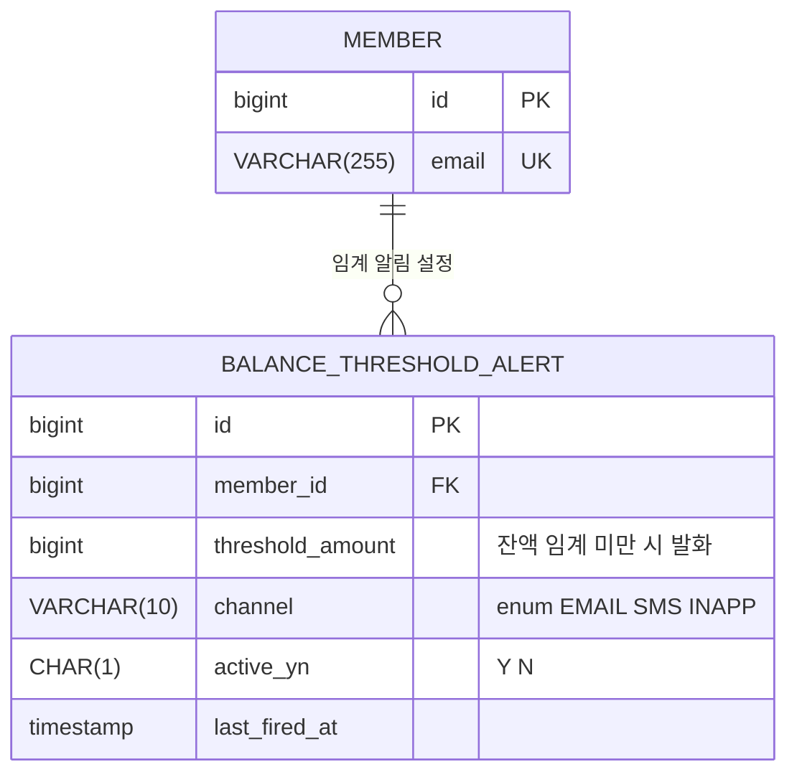
```mermaid
%%{init: {"themeVariables": {"fontSize": "16px"}}}%%
erDiagram
  MEMBER {
    bigint id PK
    VARCHAR(255) email UK
  }
  BALANCE_THRESHOLD_ALERT {
    bigint id PK
    bigint member_id FK
    bigint threshold_amount "잔액 임계 미만 시 발화"
    VARCHAR(10) channel "enum EMAIL SMS INAPP"
    CHAR(1) active_yn "Y N"
    timestamp last_fired_at
  }
  MEMBER ||--o{ BALANCE_THRESHOLD_ALERT : "임계 알림 설정"
```

- `MEMBER` 는 stub. 정본은 §1.1.
- 알림 재발화 방지 — Redis `alert:fired:{memberId}` (1시간 디바운스).

### 7.7. 노트

- **CHARGE_BALANCE 분리 보관** — 결제수단별 별도 행으로 보관. 환불 시 결제수단별 정확 라우팅 (`02_FEATURE_SPEC §10.4`).
- **회계** — `CHARGE` 시점은 예수금, `CHARGE_BALANCE_LEDGER(reason=SEND)` 시점에 매출 인식 (`02_FEATURE_SPEC §10.1`).
- **잔액 조회 hot path** — Redis `balance:{memberId}` (TTL 30초). 충전/차감 트랜잭션 AFTER_COMMIT 에서 DEL (write-around).
- **자동충전** — PG 정기결제 30일 제한 옵션 적용 (`RQ-PAY-101~109`).
- **후불 연체** — `POSTPAID_INVOICE.status = OVERDUE` 인 회사는 발송 차단 (`02_FEATURE_SPEC §10.3`).
- **현금영수증** — 신용·체크카드는 발행 불가. 환불 시 `MINUS_ISSUED` 정정.

---

## 8. 비회원 체험 모드

익명 체험 세션 + 더미 데이터 격리 영역. **본 도메인은 RDB 테이블 0건 — 모든 상태가 Redis 에 저장되고 30분 TTL 로 자동 폐기**된다. 운영 테이블과 물리적으로 다른 저장소라 격리가 약속이 아닌 인프라 수준에서 보장됨.

| 논리 엔티티 | 한글명 | 저장소 | 역할 한 줄 |
|-------------|--------|--------|------------|
| `TRIAL_SESSION` | 체험 세션 | **Redis only** | `trial:{token}` Hash — 시작시각·만료시각·핑거프린트·IP. 30분 sliding TTL |
| `TRIAL_SEND_LOG` | 체험 가상 발송 로그 | **Redis only** | `trial:{token}:sends` List — 가상 결과만, 외부 송출 0 |
| `TRIAL_CHARGE_LOG` | 체험 가상 결제 로그 | **Redis only** | `trial:{token}:charges` List — 실 결제 0, `SUCCESS` 가상 결과만 |
| `TRIAL_CALLBACK` | 체험 더미 발신번호 | **Redis only** | `trial:{token}:callbacks` Hash — KISA 미연계, `REGISTERED` 고정 |
| `TRIAL_API_KEY` | 체험 더미 키 | **Redis only** | `trial:{token}:keys` List — 실 발급 0, 표시용 마스킹 값만 |

> **KPI 측정** (`01_PRD §K3 보조` 체험→가입 전환율 ≥ 15%) 은 RDB 가 아니라 **Prometheus 카운터**로 처리. 메트릭 정의·라벨·발화 시점은 `06_OBSERVABILITY §2.5` 정본을 따른다 — 본 절은 Redis 측 발화 트리거만 다룬다.
>
> 어뷰징 차단 키: `trial:fp:{fingerprint}` (1시간 카운터).

### 8.1. ERD

> 아래 ERD 는 **논리 구조** — 실제 저장은 RDB 테이블이 아니라 Redis Hash/List. PK·FK 표기는 Redis 키 네임스페이스(`trial:{token}:*`) 로 매핑된다. 자료구조 매핑은 §8.2 참조.

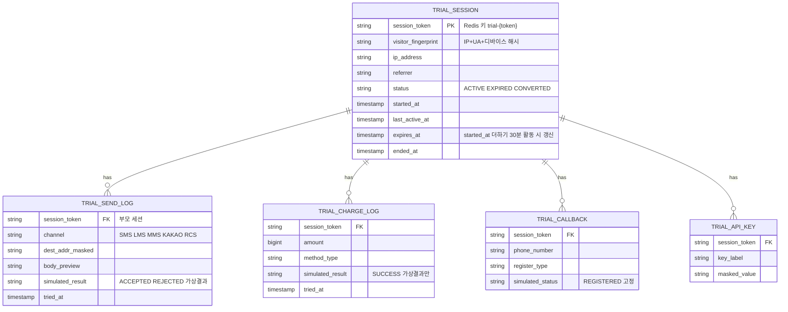
```mermaid
erDiagram
  TRIAL_SESSION {
    string session_token PK "Redis 키 trial-{token}"
    string visitor_fingerprint "IP+UA+디바이스 해시"
    string ip_address
    string referrer
    string status "ACTIVE EXPIRED CONVERTED"
    timestamp started_at
    timestamp last_active_at
    timestamp expires_at "started_at 더하기 30분 활동 시 갱신"
    timestamp ended_at
  }
  TRIAL_SEND_LOG {
    string session_token FK "부모 세션"
    string channel "SMS LMS MMS KAKAO RCS"
    string dest_addr_masked
    string body_preview
    string simulated_result "ACCEPTED REJECTED 가상결과"
    timestamp tried_at
  }
  TRIAL_CHARGE_LOG {
    string session_token FK
    bigint amount
    string method_type
    string simulated_result "SUCCESS 가상결과만"
    timestamp tried_at
  }
  TRIAL_CALLBACK {
    string session_token FK
    string phone_number
    string register_type
    string simulated_status "REGISTERED 고정"
  }
  TRIAL_API_KEY {
    string session_token FK
    string key_label
    string masked_value
  }
  TRIAL_SESSION ||--o{ TRIAL_SEND_LOG : has
  TRIAL_SESSION ||--o{ TRIAL_CHARGE_LOG : has
  TRIAL_SESSION ||--o{ TRIAL_CALLBACK : has
  TRIAL_SESSION ||--o{ TRIAL_API_KEY : has
```

### 8.2. 노트

#### Redis 자료구조 매핑

| 논리 엔티티 | Redis 키 | 자료구조 | TTL | 비고 |
|-------------|----------|----------|-----|------|
| `TRIAL_SESSION` | `trial:{token}` | Hash | 30분 (활동 시 sliding) | 시작시각·핑거프린트·IP·referrer·status |
| `TRIAL_SEND_LOG` | `trial:{token}:sends` | List (LPUSH) | 부모와 동일 만료 | 가상 발송 시도 시 LPUSH, 최대 100건 LTRIM |
| `TRIAL_CHARGE_LOG` | `trial:{token}:charges` | List | 부모 동일 | 가상 결제 시도 |
| `TRIAL_CALLBACK` | `trial:{token}:callbacks` | Hash (phone → 메타) | 부모 동일 | 더미 발신번호 등록 |
| `TRIAL_API_KEY` | `trial:{token}:keys` | List | 부모 동일 | 더미 키 표시용 |
| 어뷰징 차단 | `trial:fp:{fingerprint}` | String INCR | 1시간 | 발급 횟수 임계 검사 |

> 하위 키들은 부모 `trial:{token}` 의 sliding 갱신 시 함께 EXPIRE 재설정. 또는 Redis Hash 단일 키에 모든 필드를 묶어 `trial:{token}` 하나로도 가능 — 양은 적으니 단일 키 방식이 더 단순. 구현 시점에 선택.

#### 사용 흐름

```
① 진입: POST /try → 토큰 생성 → HMSET trial:{token} (fingerprint, ip, referrer, ...) EX 1800
② 활동: 매 요청마다 EXPIRE trial:{token} 1800 (sliding)
   + 가상 발송: LPUSH trial:{token}:sends ... EX 1800
③ 어뷰징 차단: INCR trial:fp:{fingerprint} EX 3600 → 임계 초과 시 차단
④ 만료(자동):
   - Redis keyspace notification (Kx 이벤트) 구독 → trial:* expire 감지
   - Prometheus 카운터 trial_session_expired_total 증가
⑤ 가입 전환:
   - signup 완료 시 백엔드가 토큰 확인 후 DEL trial:{token} trial:{token}:*
   - Prometheus 카운터 trial_session_converted_total 증가
   - 더미 데이터는 회원 계정으로 이관하지 않음 (폐기 강제)
```

#### Prometheus 메트릭 (KPI 측정)

→ 정본 `06_OBSERVABILITY §2.5 KPI 카운터` 참조. 트라이얼 4종 (`trial_session_started_total` / `trial_session_converted_total` / `trial_session_expired_total` / `trial_abuse_blocked_total`) 의 라벨·발화 시점·전환율 산출식은 모두 06 단일 정본.

#### 격리·만료·차단

- **격리 원칙** — Redis 키 네임스페이스 `trial:*` 가 운영 테이블과 물리적으로 다른 저장소. RDB 에는 `TRIAL_*` 테이블이 존재하지 않음. FK 연결 자체 불가능 (`02_FEATURE_SPEC §2.3`).
- **외부 차단** — 외부 송출·결제·KISA·카카오 등록은 진입 자체를 차단. Redis 키만 RW, 외부 API 호출 0.
- **어뷰징 차단** — `trial:fp:{fingerprint}` + `trial:ip:{ipHash}` 카운터로 임계 검사 (`02_FEATURE_SPEC §2.1` 사전조건).
- **가입 전환 시 폐기** — 더미는 회원 계정으로 이관 X. `DEL trial:{token}*` 일괄 삭제.

---

## 9. 운영자·감사·이상 패턴

운영자 콘솔(`admin.wisecan.com`) + 감사 로그 + 이상 패턴 자동 차단. 3 갈래라 분할:

- **§9.1 운영자 계정·권한·신뢰 IP** — `/admin/operators`, `/admin/system`
- **§9.2 감사 로그** — `/admin/audit` (append-only 5년)
- **§9.3 이상 패턴·자동 차단** — `/admin/abuse`

| 테이블 | 한글명 | 저장소 | 정본 위치 | 역할 한 줄 |
|--------|--------|--------|-----------|------------|
| `ADMIN_OPERATOR` | 운영자 계정 | RDB | §9.1 | `MEMBER` 와 분리된 별도 테이블 — 어드민 호스트 전용 |
| `ADMIN_ROLE_GRANT` | 운영자 권한 위임 | RDB | §9.1 | `SUPER_ADMIN` 이 영역별 권한 부여·회수 |
| `ADMIN_TRUSTED_IP` | 운영자 신뢰 IP | RDB | §9.1 | 화이트리스트 외 IP 어드민 로그인 차단 |
| `ADMIN_LOGIN_ATTEMPT` | 운영자 로그인 이력 | RDB | §9.1 | 2차 인증 실패·IP 차단 사유 추적 |
| `AUDIT_LOG` | 감사 로그 | RDB | §9.2 | append-only, 5년 보존 |
| `ABUSE_DETECTION` | 이상 패턴 탐지 | RDB | §9.3 | 룰엔진 결과 |
| `ABUSE_BLOCK` | 자동/수동 차단 조치 | RDB | §9.3 | 회원/키/발신번호 단위 차단 |

> 감사·운영자 도메인은 5년 보존이 법정 요구라 **전부 RDB**. 이상 패턴 룰엔진의 슬라이딩 윈도우 카운터만 Redis 별도.
>
> 이 도메인의 **Redis 전용 키**: `abuse:burst:{memberId}` (분당 발송량 슬라이딩 1시간 Sorted Set) — 룰엔진이 본 키를 읽어 임계 초과 시 RDB `ABUSE_DETECTION` INSERT.

### 9.1. 운영자 계정·권한·신뢰 IP·로그인 이력

운영자 콘솔 사용자 + 영역별 권한 위임 + 신뢰 IP 화이트리스트 + 로그인 이력 추적. `MEMBER` 와 물리적으로 분리된 테이블 (어드민 호스트 전용).

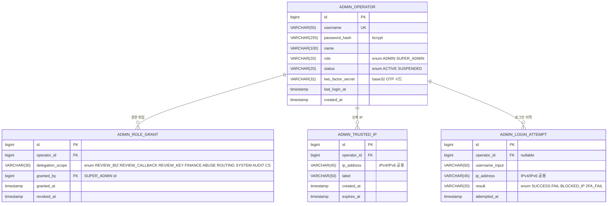
```mermaid
%%{init: {"themeVariables": {"fontSize": "16px"}}}%%
erDiagram
  ADMIN_OPERATOR {
    bigint id PK
    VARCHAR(50) username UK
    VARCHAR(255) password_hash "bcrypt"
    VARCHAR(100) name
    VARCHAR(20) role "enum ADMIN SUPER_ADMIN"
    VARCHAR(20) status "enum ACTIVE SUSPENDED"
    VARCHAR(32) two_factor_secret "base32 OTP 시드"
    timestamp last_login_at
    timestamp created_at
  }
  ADMIN_ROLE_GRANT {
    bigint id PK
    bigint operator_id FK
    VARCHAR(30) delegation_scope "enum REVIEW_BIZ REVIEW_CALLBACK REVIEW_KEY FINANCE ABUSE ROUTING SYSTEM AUDIT CS"
    bigint granted_by FK "SUPER_ADMIN id"
    timestamp granted_at
    timestamp revoked_at
  }
  ADMIN_TRUSTED_IP {
    bigint id PK
    bigint operator_id FK
    VARCHAR(45) ip_address "IPv4/IPv6 공용"
    VARCHAR(50) label
    timestamp created_at
    timestamp expires_at
  }
  ADMIN_LOGIN_ATTEMPT {
    bigint id PK
    bigint operator_id FK "nullable"
    VARCHAR(50) username_input
    VARCHAR(45) ip_address "IPv4/IPv6 공용"
    VARCHAR(20) result "enum SUCCESS FAIL BLOCKED_IP 2FA_FAIL"
    timestamp attempted_at
  }
  ADMIN_OPERATOR ||--o{ ADMIN_ROLE_GRANT : "권한 위임"
  ADMIN_OPERATOR ||--o{ ADMIN_TRUSTED_IP : "신뢰 IP"
  ADMIN_OPERATOR ||--o{ ADMIN_LOGIN_ATTEMPT : "로그인 이력"
```

- `ADMIN_OPERATOR.role = SUPER_ADMIN` 만 권한 위임(`ADMIN_ROLE_GRANT`) 발행 가능.
- 신뢰 IP 외 어드민 로그인은 `ADMIN_LOGIN_ATTEMPT(result=BLOCKED_IP)` 기록 후 차단 (`NFR-SEC-105`).
- 운영자 정보가 회원 DB 와 같은 테이블에 두면 안 됨 — 호스트 격리(`03_IA §0`).

### 9.2. 감사 로그 (append-only · 5년)

회원·운영자·시스템 모든 행위의 전·후 스냅샷. INSERT 만 허용, UPDATE/DELETE 차단.

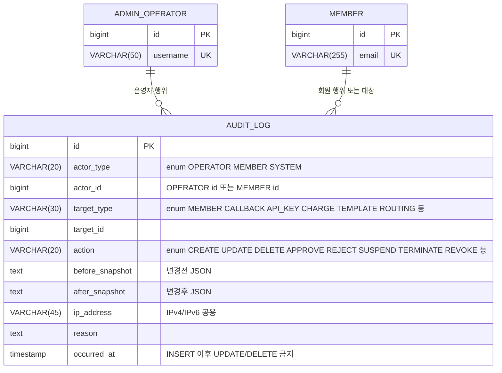
```mermaid
%%{init: {"themeVariables": {"fontSize": "16px"}}}%%
erDiagram
  ADMIN_OPERATOR {
    bigint id PK
    VARCHAR(50) username UK
  }
  MEMBER {
    bigint id PK
    VARCHAR(255) email UK
  }
  AUDIT_LOG {
    bigint id PK
    VARCHAR(20) actor_type "enum OPERATOR MEMBER SYSTEM"
    bigint actor_id "OPERATOR id 또는 MEMBER id"
    VARCHAR(30) target_type "enum MEMBER CALLBACK API_KEY CHARGE TEMPLATE ROUTING 등"
    bigint target_id
    VARCHAR(20) action "enum CREATE UPDATE DELETE APPROVE REJECT SUSPEND TERMINATE REVOKE 등"
    text before_snapshot "변경전 JSON"
    text after_snapshot "변경후 JSON"
    VARCHAR(45) ip_address "IPv4/IPv6 공용"
    text reason
    timestamp occurred_at "INSERT 이후 UPDATE/DELETE 금지"
  }
  ADMIN_OPERATOR ||--o{ AUDIT_LOG : "운영자 행위"
  MEMBER ||--o{ AUDIT_LOG : "회원 행위 또는 대상"
```

- `ADMIN_OPERATOR`·`MEMBER` 모두 stub. 정본은 §9.1 / §1.1.
- **append-only** — 트리거 또는 RLS 로 UPDATE/DELETE 차단. 5년 보존(`04_PROJECT_PLAN §8.4`).
- `actor_id` 는 `actor_type` 에 따라 `ADMIN_OPERATOR.id` 또는 `MEMBER.id` 를 가리킴 (polymorphic).
- 인덱스: `(target_type, target_id, occurred_at DESC)`, `(actor_type, actor_id, occurred_at DESC)`.

### 9.3. 이상 패턴·자동 차단

룰엔진이 슬라이딩 윈도우(Redis Sorted Set) 카운터로 발송량 급증·거부율 초과·IP 이상·콘텐츠 패턴을 탐지 → 임계 초과 시 `ABUSE_DETECTION` INSERT → 자동/수동 차단 결정.

```mermaid
%%{init: {"themeVariables": {"fontSize": "16px"}}}%%
erDiagram
  MEMBER {
    bigint id PK
    VARCHAR(255) email UK
  }
  API_KEY {
    bigint id PK
    VARCHAR(8) key_prefix
  }
  ADMIN_OPERATOR {
    bigint id PK
    VARCHAR(50) username UK
  }
  ABUSE_DETECTION {
    bigint id PK
    bigint member_id FK "nullable"
    bigint api_key_id FK "nullable"
    VARCHAR(30) rule_code "enum SEND_BURST HIGH_REJECT_RATE IP_ANOMALY CONTENT_PATTERN"
    VARCHAR(10) severity "enum INFO WARN CRITICAL"
    text evidence "JSON 발송량 거부율 등"
    VARCHAR(20) status "enum DETECTED REVIEWING RESOLVED BLOCKED"
    timestamp detected_at
    timestamp resolved_at
  }
  ABUSE_BLOCK {
    bigint id PK
    bigint detection_id FK
    VARCHAR(20) block_target "enum MEMBER API_KEY CALLBACK"
    bigint target_id
    VARCHAR(500) block_reason
    bigint operator_id FK "nullable 자동차단은 NULL"
    timestamp blocked_at
    timestamp released_at
  }
  MEMBER ||--o{ ABUSE_DETECTION : "이상 패턴 대상"
  API_KEY ||--o{ ABUSE_DETECTION : "키 단위 이상"
  ABUSE_DETECTION ||--o| ABUSE_BLOCK : "차단 조치"
  ADMIN_OPERATOR ||--o{ ABUSE_BLOCK : "수동 차단 수행자"
```

- `MEMBER`·`API_KEY`·`ADMIN_OPERATOR` 모두 stub. 정본은 §1.1 / §4.1 / §9.1.
- 자동 차단 시 `ABUSE_BLOCK.operator_id = NULL` — 수동 차단은 운영자 ID 기록.
- 차단 발효 시 대상 객체 status 동기 변경:
  - `MEMBER` → `SUSPENDED`
  - `API_KEY` → `SUSPENDED`
  - `CALLBACK` → `DELETED`
- 회원에게 알림 발송 + 해제 신청 채널 제공(`02_FEATURE_SPEC §13.2`).

### 9.4. 노트

- **append-only 보장** — `AUDIT_LOG` 는 INSERT 외 차단. MySQL 의 경우 `BEFORE UPDATE` / `BEFORE DELETE` 트리거로 예외 raise.
- **운영자·회원 분리** — 호스트 자체가 다르므로 회원이 운영자 URL 호출 시 401(`03_IA §0`).
- **신뢰 IP 외 어드민 로그인 차단** — `ADMIN_LOGIN_ATTEMPT(result=BLOCKED_IP)` 기록 후 거부.
- **이상 패턴 슬라이딩 윈도우** — Redis Sorted Set 으로 분당 발송량 트래킹. 1시간 윈도우.

---

## 10. CS·공지·문서

1:1 문의 + 공지 + FAQ + SDK/CLI/MCP 문서 코퍼스. 4 갈래라 분할:

- **§10.1 1:1 문의** — `/inquiries` + `/admin/cs`
- **§10.2 공지** — `/notices` (회원) + `/admin/cs` (운영자 게시)
- **§10.3 FAQ** — `/faq` (회원) + `/admin/cs` (운영자 관리)
- **§10.4 SDK/CLI/MCP 문서 코퍼스** — `/docs/{sdk,cli,mcp}` (회원) + `/admin/{sdk,cli,mcp}` (운영자)

| 테이블 | 한글명 | 저장소 | 정본 위치 | 역할 한 줄 |
|--------|--------|--------|-----------|------------|
| `INQUIRY` | 1:1 문의 헤더 | RDB | §10.1 | 회원당 N건 — 첫 응답까지 24h SLA |
| `INQUIRY_MESSAGE` | 문의 스레드 메시지 | RDB | §10.1 | 회원/운영자/봇 발화 시퀀스 + 첨부 |
| `NOTICE` | 공지 | **RDB + Redis** | §10.2 | 페르소나 타겟팅 + 고정 옵션 |
| `NOTICE_READ` | 공지 확인 이력 | RDB | §10.2 | 회원별 확인 시각 — 미확인 뱃지 |
| `FAQ_CATEGORY` | FAQ 분류 | **RDB + Redis** | §10.3 | 정렬 순서 보존 |
| `FAQ` | FAQ 항목 | **RDB + Redis** | §10.3 | 질문/답변 + 게시 여부 |
| `DOC_CORPUS` | 문서 코퍼스 (단일 진실 원천) | RDB | §10.4 | SDK/CLI/MCP × 주제 × 언어 — MCP↔CLI 동등성 원천 |
| `DOC_VERSION` | 문서 버전 | RDB | §10.4 | semver 버전별 본문 |

> 이 도메인의 **Redis 캐시 키**: `notice:active:{audience}` (활성 공지 5분, pub/sub `notice-published`), `faq:tree` (FAQ 트리 10분).

### 10.1. 1:1 문의

회원이 `/inquiries` 에서 문의 등록 → 운영자가 `/admin/cs` 에서 답변. 24h SLA 측정.

```mermaid
%%{init: {"themeVariables": {"fontSize": "16px"}}}%%
erDiagram
  MEMBER {
    bigint id PK
    VARCHAR(255) email UK
  }
  ADMIN_OPERATOR {
    bigint id PK
    VARCHAR(50) username UK
  }
  INQUIRY {
    bigint id PK
    bigint member_id FK
    VARCHAR(200) subject
    VARCHAR(20) category "enum BILLING SENDING CALLBACK KEY OTHER"
    VARCHAR(20) status "enum OPEN ANSWERED CLOSED"
    bigint assigned_operator_id FK "nullable"
    timestamp opened_at
    timestamp first_response_at
    timestamp closed_at
  }
  INQUIRY_MESSAGE {
    bigint id PK
    bigint inquiry_id FK
    VARCHAR(20) author_type "enum MEMBER OPERATOR BOT"
    bigint author_id "MEMBER id 또는 OPERATOR id"
    text body
    text attachments "JSON 파일 메타"
    timestamp posted_at
  }
  MEMBER ||--o{ INQUIRY : "문의"
  INQUIRY ||--o{ INQUIRY_MESSAGE : "스레드 메시지"
  ADMIN_OPERATOR ||--o{ INQUIRY : "담당 운영자"
```

- `MEMBER`·`ADMIN_OPERATOR` 모두 stub. 정본은 §1.1 / §9.1.
- `first_response_at - opened_at` ≤ 24h SLA 측정 (`04_PROJECT_PLAN §8.3`).
- `INQUIRY_MESSAGE.author_id` 는 polymorphic — `author_type` 에 따라 MEMBER 또는 ADMIN_OPERATOR 참조.

### 10.2. 공지

운영자가 `/admin/cs` 에서 공지 게시 → 회원이 `/notices` 또는 대시보드 배너로 확인. 페르소나 타겟팅.

```mermaid
%%{init: {"themeVariables": {"fontSize": "16px"}}}%%
erDiagram
  MEMBER {
    bigint id PK
    VARCHAR(255) email UK
  }
  ADMIN_OPERATOR {
    bigint id PK
    VARCHAR(50) username UK
  }
  NOTICE {
    bigint id PK
    VARCHAR(200) title
    text body
    VARCHAR(20) audience "enum ALL PERSONAL BUSINESS COMPANY_MASTER"
    CHAR(1) pinned "Y N 상단 고정"
    timestamp published_at
    timestamp expires_at
    bigint author_operator_id FK
  }
  NOTICE_READ {
    bigint id PK
    bigint notice_id FK
    bigint member_id FK
    timestamp read_at
  }
  ADMIN_OPERATOR ||--o{ NOTICE : "게시"
  NOTICE ||--o{ NOTICE_READ : "확인 이력"
  MEMBER ||--o{ NOTICE_READ : "확인자"
```

- `MEMBER`·`ADMIN_OPERATOR` 모두 stub. 정본은 §1.1 / §9.1.
- `NOTICE.audience` — `BUSINESS` 공지는 개인 회원에게 미노출. `COMPANY_MASTER` 공지는 회사 마스터만.
- 활성 공지 캐시 — Redis `notice:active:{audience}` (5분 TTL). 게시·만료·삭제 시 pub/sub `notice-published` 발행으로 즉시 무효화.

### 10.3. FAQ

운영자가 `/admin/cs` 에서 FAQ 등록 → 회원이 `/faq` 에서 분류별로 조회. 트리 전체를 Redis 캐시.

```mermaid
%%{init: {"themeVariables": {"fontSize": "16px"}}}%%
erDiagram
  FAQ_CATEGORY {
    bigint id PK
    VARCHAR(100) name
    int sort_order
  }
  FAQ {
    bigint id PK
    bigint category_id FK
    VARCHAR(500) question
    text answer
    int sort_order
    CHAR(1) published "Y N"
    timestamp updated_at
  }
  FAQ_CATEGORY ||--o{ FAQ : "분류"
```

- 외부 참조 없음 — 운영자 콘솔에서만 작성·수정.
- 트리 전체를 한 번에 `faq:tree` (Redis Hash, 10분 TTL) 로 캐싱. 운영자 수정 시 DEL.
- `FAQ.published = 'N'` 인 항목은 회원 노출 X.

### 10.4. SDK/CLI/MCP 문서 코퍼스

운영자가 `/admin/{sdk,cli,mcp}` 에서 문서 작성·버전 게시 → 회원이 `/docs/{sdk,cli,mcp}` + MCP/CLI 도구가 같은 corpus 를 조회. MCP↔CLI 동등성의 단일 진실 원천.

```mermaid
%%{init: {"themeVariables": {"fontSize": "16px"}}}%%
erDiagram
  ADMIN_OPERATOR {
    bigint id PK
    VARCHAR(50) username UK
  }
  DOC_CORPUS {
    bigint id PK
    VARCHAR(10) surface "enum SDK CLI MCP"
    VARCHAR(30) topic "send history auth install 등"
    VARCHAR(10) locale "enum ko_KR en_US"
  }
  DOC_VERSION {
    bigint id PK
    bigint corpus_id FK
    VARCHAR(20) version "semver"
    text body_markdown
    bigint author_operator_id FK
    CHAR(1) published "Y N"
    timestamp published_at
  }
  DOC_CORPUS ||--o{ DOC_VERSION : "버전 이력"
  ADMIN_OPERATOR ||--o{ DOC_VERSION : "작성자"
```

- `ADMIN_OPERATOR` 는 stub. 정본은 §9.1.
- **MCP↔CLI 동등성** — 동일 `topic` 의 `DOC_CORPUS` 가 `surface=CLI` 와 `surface=MCP` 양쪽에 존재. 본문은 surface 별로 다를 수 있으나 다루는 도구·기능 카탈로그는 일치 (`02_FEATURE_SPEC §7.4`).
- `DOC_VERSION.published = 'Y'` 인 최신 semver 가 회원 노출본.

### 10.5. 노트

- `INQUIRY` SLA — `first_response_at - opened_at` ≤ 24h. 미달성 시 운영 게이트 미통과 (`04_PROJECT_PLAN §8.3`).
- 공지 hot path — Redis `notice:active:{audience}` 캐시 사용. 게시·만료·삭제 시 pub/sub `notice-published` 로 다중 노드 즉시 무효화.
- FAQ 캐시 무효화 — 운영자 수정 시 `faq:tree` DEL.
- 문서 코퍼스가 단일 진실 원천이라 MCP·CLI 진입점이 갈라져도 같은 데이터를 surface 컬럼으로 구분해 조회.

---

## 11. 통합 관계도 (도메인 간 핵심 연결)

도메인 10개를 1장 ERD 로 압축 — 각 도메인의 **루트 엔티티만** 표시.

| 루트 엔티티 | 소속 도메인 | 한 줄 |
|-------------|-------------|-------|
| `MEMBER` | §1 회원·인증 | 모든 도메인의 허브 — 발신번호·키·발송·결제·문의 등 대부분이 회원에 매달림 |
| `BUSINESS_APPLICATION` | §1 회원·인증 | 사업자 가입 신청 — 승인되면 `COMPANY` 생성 |
| `COMPANY` | §2 회사 | 사업자 회원의 단체 단위 — 후불 모델·하위 계정 묶음 |
| `POSTPAID_CONFIG` | §7 결제 | 회사 단위 후불 설정 |
| `CALLBACK` | §3 발신번호 | 발송의 발신자 — KISA 등록 후 사용 가능 |
| `API_KEY` | §4 API 키 | SDK·CLI·MCP 발송의 진입점 인증 |
| `send_*_tran` / `send_*_log_YYYYMM` (외부) | §5 발송 | SMS·MMS·카카오·RCS 진행·로그 8 패밀리 — 외부 발송 시스템 소유 |
| `kko_template` / `kko_brand_template` / `kko_template_category` / `kko_template_history` (외부) | §6 카카오/RCS | 카카오 알림톡 템플릿·브랜드·카테고리·이력 4종 — 외부 발송 시스템 소유 |
| `rcs_template` / `rcs_template_form` / `rcs_template_component` / `rcs_template_hist` (외부) | §6 카카오/RCS | RCS 템플릿·양식·컴포넌트·이력 4종 — 외부 발송 시스템 소유 |
| `ROUTING_MAPPING` (외부) | §6 카카오/RCS | 외부 시스템 테이블 — 본 ERD 정의 범위 외 |
| `CHARGE` | §7 결제 | 충전 단위 |
| `CHARGE_BALANCE` | §7 결제 | 결제수단별 분리된 예수금 — FIFO 차감 후보 |
| `CHARGE_BALANCE_LEDGER` | §7 결제 | 잔액 변동 원장 — 외부 적재 직전 차감(−), 실패 시 REVERT 보상행(+), 운영자 ADJUST 가감 |
| `TRIAL_SESSION` | §8 체험 | 비회원 체험 진입 — 가입 전환 시 폐기 |
| `ADMIN_OPERATOR` | §9 운영자 | 어드민 콘솔 사용자 — `MEMBER` 와 완전 분리 |
| `AUDIT_LOG` | §9 운영자 | append-only 5년 — 회원·운영자 모든 행위 추적 |
| `ABUSE_DETECTION` | §9 운영자 | 이상 패턴 룰엔진 결과 |
| `INQUIRY` | §10 CS | 1:1 문의 헤더 |

```mermaid
erDiagram
  MEMBER ||--o| BUSINESS_APPLICATION : "사업자신청"
  MEMBER ||--o| COMPANY : "회사소속"
  COMPANY ||--o| POSTPAID_CONFIG : "후불"
  MEMBER ||--o{ CALLBACK : "발신번호"
  MEMBER ||--o{ API_KEY : "API키"
  MEMBER ||--o{ EXTERNAL_SEND : "발송 검증·적재"
  API_KEY ||--o{ EXTERNAL_SEND : "진입점"
  CALLBACK ||--o{ EXTERNAL_SEND : "발신번호"
  MEMBER ||--o{ EXTERNAL_KAKAO_TEMPLATE : "카카오 외부 조회"
  MEMBER ||--o{ EXTERNAL_RCS_BRAND : "RCS 외부 조회"
  MEMBER ||--o| EXTERNAL_ROUTING : "중계사 외부 조회"
  MEMBER ||--o{ CHARGE : "충전"
  CHARGE ||--|| CHARGE_BALANCE : "충전 잔액"
  CHARGE_BALANCE ||--o{ CHARGE_BALANCE_LEDGER : "잔액 변동"
  EXTERNAL_SEND ||--o{ CHARGE_BALANCE_LEDGER : "발송 차감"
  MEMBER ||--o{ INQUIRY : "1대1문의"
  ADMIN_OPERATOR ||--o{ AUDIT_LOG : "감사주체"
  MEMBER ||--o{ AUDIT_LOG : "감사대상"
  MEMBER ||--o{ ABUSE_DETECTION : "이상패턴"
  TRIAL_SESSION }o..o| MEMBER : "가입전환 폐기"
```

---

## 12. 데이터 모델 핵심 불변식 (요약)

| # | 불변식 | 근거 |
|---|--------|------|
| INV-01 | `MEMBER` 와 `ADMIN_OPERATOR` 는 서로 다른 테이블·다른 호스트에서만 사용 | `03_IA §0`, NFR-SEC-105 |
| INV-02 | 외부 적재 테이블의 `routing_meta` (중계사 매핑) 는 본 서비스 응답·UI·이력 어디에도 나타나지 않는다 | `01_PRD` 차별화 ②, `02_FEATURE_SPEC §12.4`, §5.2 |
| INV-03 | `CHARGE_BALANCE` 는 결제수단별 분리 보관, 차감은 `(expires_at ASC, charged_at ASC)` FIFO | `02_FEATURE_SPEC §10.1`, `RQ-PAY-013` |
| INV-04 | `CHARGE_BALANCE` 충전 후 5년 경과 시 자동 소멸 — 환불 불가 | `02_FEATURE_SPEC §10.4` |
| INV-05 | `AUDIT_LOG` 는 append-only, UPDATE/DELETE 차단, 5년 보존 | `04_PROJECT_PLAN §8.4` |
| INV-06 | `TRIAL_*` 는 RDB 테이블 부재 — Redis `trial:*` 네임스페이스 단독 저장. 30분 TTL 자동 폐기, 가입 전환 시 `DEL trial:{token}*` 일괄. KPI 는 Prometheus 카운터 (`02_FEATURE_SPEC §2.3`, §8.2) | §8.2 |
| INV-07 | `API_KEY.key_hash` 만 저장, 평문은 발급 직후 1회만 노출 | `02_FEATURE_SPEC §5.4` |
| INV-08 | `API_KEY.environment = TEST` 키로 상용 발송 적재 시도는 거부 | `04_PROJECT_PLAN W-205` |
| INV-09 | 카카오 채널 발송은 외부 시스템 카카오 템플릿이 `APPROVED` 상태일 때만 통과 — 본 서비스가 발송 직전 검증 게이트로 동작 | `02_FEATURE_SPEC §9.1`, §6 |
| INV-10 | `BUSINESS_REVIEW_CALL` 통화녹음 5년 보존, `recording_cloud_path` + `recording_local_path` 이중 | `02_FEATURE_SPEC §12.1` |
| INV-11 | 회원 `TERMINATED` 전이 시 보유 `CALLBACK`·`API_KEY` 일괄 무효 + KISA 연쇄 해제 | `02_FEATURE_SPEC §12.3` |
| INV-12 | `POSTPAID_INVOICE.status = OVERDUE` 회사는 발송 차단 | `02_FEATURE_SPEC §10.3` |
| INV-13 | 회사당 `MEMBER.role = COMPANY_MASTER` 는 최대 1명 — 부분 UNIQUE 인덱스로 DB level 강제 | `02_FEATURE_SPEC §3.2`, §2.3 |
| INV-14 | `COMPANY.status = ACTIVE` 인 회사는 마스터 정확히 1명. 사업자 가입 승인 시 자동 부여, 회수·탈퇴 시 `(created_at ASC, id ASC)` 첫 ACTIVE 멤버로 자동 전이. 후보 0명 시 `COMPANY.status = SUSPENDED` 자동 전이 | §2.3 시나리오 ①·③·④ |
| INV-15 | API Key 인증 성공 조건 — `status = ACTIVE` AND `expires_at > NOW()`. 모든 키는 유한 수명 (무기한 옵션 없음 — `expires_at` NOT NULL). 만료 시 `401 KEY_EXPIRED` 응답 + status 를 `EXPIRED` 로 자동 전이. `API_KEY.status` enum 에 `PENDING` placeholder 없음 — 심사 중 상태는 `API_KEY_REQUEST.status = REQUESTED` 로 표현 | §4.1, §4.2 만료 정책 |
| INV-16 | 동일 정규화 `phone_number` 의 활성 등록(`CALLBACK.status ∈ {SUBMITTED, UNDER_REVIEW, REGISTERED}`)은 **전 시스템 1개**. 부분 UNIQUE 인덱스로 DB level 강제. 이관·재등록은 `CALLBACK_OWNERSHIP_LOG` 이력 INSERT + 기존 row 종료 상태(`DELETED`/`REJECTED`) 전이 후에만 신규 row 허용 | §3.1, §3.2 |
| INV-17 | `API_KEY` row 는 운영자 승인 시점에만 생성 — placeholder 발급 금지. 신청 큐는 `API_KEY_REQUEST` 로 완전 분리, 승인 시 `API_KEY_REQUEST.issued_api_key_id` ↔ `API_KEY.issued_from_request_id` 양방향 링크 | §4.1 |
| INV-18 | `COMPANY.billing_mode = POSTPAID` 인 회사 소속 멤버는 **선불 기능 일체 불가** — `CHARGE` INSERT 거부, `AUTO_CHARGE_CONFIG` 등록 거부, 신규 `CHARGE_BALANCE` 생성 안 됨. 개인 회원(`company_id IS NULL`)과 `billing_mode = PREPAID` 회사 멤버만 선불 흐름 사용. 회사 모드 전환 시 활성 자동충전 자동 비활성화 + PG 빌키 해지 | §7.1, §7.3, §2.1 |

---

## 13. 인덱스·파티셔닝 가이드 (1차)

| 테이블 | 인덱스 | 이유 |
|--------|--------|------|
| `MEMBER` | `(email)` UK, `(company_id, status)`, **부분 UNIQUE** `(company_id) WHERE role='COMPANY_MASTER'` | 로그인·회사 멤버 조회·회사당 마스터 1명 강제 (INV-13) |
| `AUTH_SESSION` | `(refresh_token_hash)` UK, `(member_id, expires_at)` | 토큰 검증·만료 정리 |
| `CALLBACK` | `(member_id, status)`, **부분 UNIQUE** `(phone_number) WHERE status IN ('SUBMITTED','UNDER_REVIEW','REGISTERED')` | 목록 조회·동일 번호 활성 등록 1개 강제 (INV-16) |
| `CALLBACK_OWNERSHIP_LOG` | `(phone_number, transferred_at DESC)`, `(from_callback_id)`, `(to_callback_id)` | 번호별 소유권 이력 추적·역참조 |
| `API_KEY` | `(key_hash)` UK, `(member_id, environment, status)`, `(issued_from_request_id)` | 인증·운영키 조회·발급 근거 역참조 |
| `API_KEY_REQUEST` | `(status, requested_at DESC)`, `(member_id, requested_at DESC)`, `(source_api_key_id)` | 심사 큐·신청자 이력·운영전환 소스 추적 |
| `API_USAGE` | `(api_key_id, called_at DESC)` | 사용량 통계 |
| `send_*_tran` (외부) | `idx_fetch (message_state, request_date, msg_type)` | 외부 송출 큐 fetch (§5.1) |
| `send_*_log_YYYYMM` (외부) | `idx_user (user_id, group_id)`, `idx_request_date (request_date, msg_type)` | 회원 이력 조회 + 월별 RANGE 분할 (§5.1) |
| `CHARGE_BALANCE` | `(member_id, amount_remaining, expires_at)` | FIFO 차감 후보 선정 |
| `CHARGE_BALANCE_LEDGER` | `(charge_balance_id, recorded_at DESC)`, `(send_message_id)` | 잔액 변동 조회·역추적 |
| `CHARGE` | `(member_id, created_at DESC)`, `(pg_tx_id)` UK | 충전 거래 조회·PG 멱등성 |
| `AUDIT_LOG` | `(target_type, target_id, occurred_at DESC)`, `(actor_type, actor_id, occurred_at DESC)` | 감사 조회 |
| `ABUSE_DETECTION` | `(status, severity, detected_at DESC)` | 처리 큐 |

**파티셔닝 후보** — `API_USAGE`, `AUDIT_LOG`, `CHARGE_BALANCE_LEDGER` 는 월 단위 RANGE 파티셔닝 검토(데이터 누적 속도 ≥ 일 100만 행 가정 시). 외부 발송 시스템 테이블 파티셔닝은 외부 시스템 책임.

---

## 14. 저장소 전략 — Redis 와 RDB 의 역할 분담

본 절은 각 데이터를 **어디에 둘지** 결정한다. 회계·감사·외부 시스템 합의는 RDB 진실 원천, 휘발성·고빈도 hot path 는 Redis. 진실 원천이 RDB 인 데이터를 Redis 에 캐시하는 경우는 무효화 정책을 명시한다.

### 14.1. 판단 기준 5가지

| # | 기준 | RDB | Redis |
|---|------|-----|-------|
| C1 | 영속성·내구성 (서버 재시작 후 보존) 필수 | ⭕ | ❌ (AOF/RDB 백업 있어도 진실 원천 X) |
| C2 | 회계·감사·법정 보존 기간 (5년 등) | ⭕ | ❌ |
| C3 | 외부 시스템(KISA·PG·중계사) 합의된 식별자 | ⭕ | ❌ |
| C4 | 짧은 TTL (분/시간 단위) + 만료 후 폐기 OK | ❌ (불필요한 행 누적) | ⭕ |
| C5 | hot path 의 ms 단위 응답 + 초당 수천 회 조회 | △ (캐시 필요) | ⭕ |
| C6 | 슬라이딩 윈도우·카운터·Rate Limit·세션 만료 | △ | ⭕ |
| C7 | pub/sub 즉시 무효화 신호 (다중 노드 전파) | ❌ | ⭕ |

> RDB 는 Oracle/MySQL 둘 다 가능한 표준 SQL. Redis 는 Spring Data Redis + `RedisTemplate` (백엔드의 `RedisConfig` 가 이미 셋업되어 있음).

### 14.2. RDB 전용 — 진실 원천 (Source of Truth)

영구·정합·감사 대상으로 Redis 에 두면 안 된다.

| 도메인 | 테이블 | 사유 |
|--------|--------|------|
| §1 회원 | `MEMBER`, `BUSINESS_APPLICATION`, `BUSINESS_DOCUMENT`, `BUSINESS_REVIEW_CALL`, `IDENTITY_VERIFICATION`, `TERM_AGREEMENT` | 영구·법정 보존(통화 녹음 5년·동의 이력) |
| §1 회원 | `LOGIN_ATTEMPT` | 감사·이상 패턴 분석 원본 (잠금 카운터만 Redis 별도) |
| §2 회사 | `COMPANY`, `COMPANY_ROLE_LOG`, `COMPANY_INVITATION` | 권한 이력 감사 |
| §3 발신번호 | `CALLBACK`, `CALLBACK_DOCUMENT`, `CALLBACK_REVIEW`, `KISA_REGISTRATION` | 외부 시스템(KISA) 합의 + 감사 |
| §4 API 키 | `API_KEY`, `API_KEY_REQUEST`, `API_KEY_SCOPE`, `API_KEY_CALLBACK_WHITELIST`, `API_KEY_LIMIT` | 정합성 + 운영자 승인 시점에만 키 발급 (인증 hot path 캐시는 §14.4) |
| §4 API 키 | `API_USAGE` | 사용량 통계·감사 — 인덱스 + 파티셔닝 |
| §5 발송 | (외부 시스템) | 외부 발송 시스템 소유 — 본 서비스는 검증·적재·결과 조회만 |
| §6 카카오/RCS | (외부 시스템) | 외부 시스템 소유 — 본 서비스는 검증 게이트 + 결과 조회 캐시만 |
| §7 결제 | `PAYMENT_METHOD`, `CHARGE`, `CHARGE_BALANCE`, `CHARGE_BALANCE_LEDGER`, `AUTO_CHARGE_CONFIG`, `POSTPAID_*`, `REFUND_REQUEST`, `CASH_RECEIPT` | 회계 진실 원천 — 절대 Redis 진실원천 금지 |
| §9 운영자 | `ADMIN_OPERATOR`, `ADMIN_ROLE_GRANT`, `ADMIN_TRUSTED_IP`, `ADMIN_LOGIN_ATTEMPT`, `AUDIT_LOG`, `ABUSE_DETECTION`, `ABUSE_BLOCK` | 감사 5년 append-only |
| §10 CS | `INQUIRY`, `INQUIRY_MESSAGE`, `NOTICE`, `NOTICE_READ`, `FAQ*`, `DOC_CORPUS`, `DOC_VERSION` | 영구 + SLA 측정 |

### 14.3. Redis 전용 — 휘발성 hot path (RDB 미저장)

만료 후 사라져도 무방한 데이터. RDB 에 대응 테이블을 만들지 않는다.

| 용도 | Redis 자료구조 | TTL | 키 패턴 | 비고 |
|------|----------------|-----|---------|------|
| Access Token 블랙리스트 (로그아웃·강제 폐기) | String | accessTokenTTL (예: 12h) | `blacklist:jwt:{jti}` | 백엔드 `TokenBlacklistService` 가 이미 사용 중 |
| 휴대폰 본인인증 코드 | String | 3분 | `verify:phone:{phone}` | 검증 성공 시 즉시 DEL |
| 이메일 인증 토큰 | String | 24시간 | `verify:email:{token}` | 가입 직후 비동기 발송 |
| 비밀번호 재설정 토큰 | String | 30분 | `pwreset:{token}` | 1회용 — 사용 시 DEL |
| OTP 시도 카운터 | String INCR | 15분 | `otp:try:{memberId}` | 5회 초과 시 잠금 |
| 로그인 잠금 플래그 | String | 15분 | `login:lock:{memberId}` | 5회 실패 → SET — `LOGIN_ATTEMPT` 에는 영구 기록 별도 |
| CAPTCHA 요구 플래그 | String | 15분 | `captcha:require:{ipHash}` | IP 단위 |
| 발송 Rate Limit | Sorted Set | 슬라이딩 60초 | `ratelimit:send:{apiKeyId}` | ZADD now + ZREMRANGEBYSCORE |
| API 호출 Rate Limit | String INCR | 1분 | `ratelimit:api:{apiKeyId}:{minute}` | 분당 호출 수 |
| 일일 발송 한도 누적 | String INCR | 익일 0시까지 | `quota:daily:{apiKeyId}:{yyyymmdd}` | `API_KEY_LIMIT.daily_send_limit` 와 대조 |
| 체험 세션 본체 | Hash | 30분 sliding | `trial:{sessionToken}` | 시작시각·핑거프린트·IP·referrer·status — RDB 미사용 |
| 체험 가상 발송 로그 | List | 부모 동일 | `trial:{sessionToken}:sends` | LPUSH + LTRIM 100건 |
| 체험 가상 결제 로그 | List | 부모 동일 | `trial:{sessionToken}:charges` | SUCCESS 가상 결과만 |
| 체험 더미 발신번호 | Hash | 부모 동일 | `trial:{sessionToken}:callbacks` | REGISTERED 고정 |
| 체험 더미 API 키 | List | 부모 동일 | `trial:{sessionToken}:keys` | 표시용 마스킹 |
| 체험 발급 횟수 (어뷰징 차단) | String INCR | 1시간 | `trial:fp:{fingerprint}` | 임계 초과 시 차단 |
| 체험 IP 발급 횟수 | String INCR | 1시간 | `trial:ip:{ipHash}` | IP 단위 추가 차단 |
| 자동충전 중복 실행 분산 락 | String SETNX | 30초 | `lock:auto-charge:{memberId}` | 임계 도달 시 1노드만 실행 |
| KISA 사전 등록 여부 빠른 확인 | String | 10분 | `kisa:cache:{phone}` | 발송 검증 hot path |
| 카카오 템플릿 승인 여부 빠른 확인 | Hash | 10분 | `tmpl:approved:{memberId}:{templateCode}` | 발송 검증 hot path |
| 이상 패턴 슬라이딩 윈도우 | Sorted Set | 1시간 | `abuse:burst:{memberId}` | 분당 발송량 트래킹 |
| 잔액 임계 알림 발화 방지 | String | 1시간 | `alert:fired:{memberId}` | 알림 재발사 디바운스 |

### 14.4. 하이브리드 — RDB 진실 원천 + Redis 캐시

| 데이터 | RDB 본 | Redis 캐시 | 무효화 시점 |
|--------|--------|------------|-------------|
| 회원 세션 (refresh 토큰) | `AUTH_SESSION` | `refresh:{tokenHash}` → memberId·deviceLabel (Hash, TTL=리프레시TTL) | 로그아웃·강제 만료 시 DEL + `AUTH_SESSION.revoked_at` UPDATE |
| API 키 → 인증 정보 | `API_KEY` + `API_KEY_SCOPE` | `auth:apikey:{keyHash}` → memberId·env·status·scopes 묶음 (Hash, TTL=10분) | 키 폐기·스코프 변경 시 즉시 DEL + pub/sub `keyrevoke` 채널 발행 |
| 회원 잔액 합계 | `CHARGE_BALANCE.amount_remaining` 합산 | `balance:{memberId}` → int (TTL=30초) | 발송 차감/충전/환불 트랜잭션 커밋 후 DEL (write-around) |
| 중계사 라우팅 매핑 | (외부 시스템 조회) | `routing:{memberId}` → kakaoProvider·rcsProvider (Hash, TTL=10분) | 외부 시스템에서 변경 시 webhook 으로 DEL |
| 활성 공지 | `NOTICE` (audience·published_at·expires_at) | `notice:active:{audience}` → JSON 배열 (TTL=5분) | 공지 게시·만료·삭제 시 즉시 DEL |
| 회원 KISA 등록 발신번호 목록 | `CALLBACK.kisa_status=REGISTERED` | `caller:registered:{memberId}` → Set(phone) (TTL=10분) | 등록 승인·삭제 시 DEL |
| FAQ 카테고리·항목 | `FAQ_CATEGORY`+`FAQ` | `faq:tree` → JSON (TTL=10분) | 운영자 수정 시 DEL |

> **캐시 정책**
> - **읽기**: `Cache → Miss 시 RDB → 캐시 적재` (cache-aside).
> - **쓰기**: RDB 커밋 후 캐시 DEL (write-around). 캐시에 직접 write 금지 — RDB 가 진실 원천.
> - **TTL** 은 무효화 신호 누락 대비 안전망. 짧을수록 정합성 ↑, RDB 부하 ↑.

### 14.5. Redis 키 명명 컨벤션

```
{도메인}:{서브목적}:{식별자}[:{서브식별자}]
```

- 모두 소문자 + `:` 구분.
- 식별자는 hash 가능한 short ID (member_id, api_key_id, ULID, IP 해시 등).
- 평문 phone·email 을 키에 노출하지 않는다 — 필요 시 `sha256(phone).hex().slice(0, 16)` 같이 마스킹.
- 카운터 키에는 시간 윈도우(`:{yyyymmdd}`, `:{minute}`) 를 붙여 자연 만료.

### 14.6. 캐시 무효화 정책

1. **TTL 기반** — 모든 캐시는 TTL 보유 (절대 영구 캐시 금지). 무효화 누락 시 안전망.
2. **이벤트 기반** — 트랜잭션 커밋 후 `RedisTemplate.delete(key)`. Spring `@TransactionalEventListener(phase = AFTER_COMMIT)` 으로 호출.
3. **pub/sub 기반** — 다중 노드 즉시 전파.
   - `keyrevoke` 채널: API 키 폐기 시 모든 노드의 `auth:apikey:{hash}` 캐시 DEL.
   - `routing-changed` 채널: 라우팅 매핑 변경 시 모든 노드 캐시 DEL.
   - `notice-published` 채널: 공지 게시 시 모든 노드 `notice:active:*` DEL.

> **금지 패턴** — RDB 트랜잭션 안에서 Redis DEL 호출. 트랜잭션 롤백 시 캐시만 비워져 정합성 깨짐. 반드시 AFTER_COMMIT phase.

### 14.7. 분산 락 (Redis 단일 활용 케이스)

| 락 | 키 | TTL | 용도 |
|----|----|-----|------|
| 자동충전 중복 방지 | `lock:auto-charge:{memberId}` | 30초 | 잔액 임계 도달 시 단일 노드만 PG 결제 |
| 발신번호 등록 동시 KISA 호출 방지 | `lock:kisa:{phone}` | 60초 | 중복 등록 신청 차단 |
| 후불 청구서 발행 중복 방지 | `lock:invoice:{companyId}:{period}` | 5분 | 정산 주기 batch 단일 실행 |
| 잔액 차감 직렬화 (옵션) | `lock:balance:{memberId}` | 10초 | 동시 발송 시 차감 race condition 회피 — DB row-level lock 우선이고 Redis 락은 보강 |

> Redisson 또는 `SET ... NX EX` 로 구현. **반드시 token-with-expiry 방식** — 락 보유자만 해제 가능 (좀비 락 방지).

### 14.8. 핵심 데이터 흐름 케이스 4종

**케이스 ①: API Key 인증 + 발송 적재 (hot path)**

```
1) 요청 도착: Authorization: ApiKey xxx
2) Redis GET auth:apikey:{hash}
   - HIT → memberId/scopes 즉시 확보
   - MISS → RDB SELECT api_key + api_key_scope → Redis SET (TTL=10m)
3) Redis ZADD ratelimit:send:{apiKeyId} now → ZCARD 검사
4) Redis GET kisa:cache:{phone} → 발신번호 등록 여부 확인 (MISS 시 RDB)
5) Redis GET balance:{memberId} → 잔액 사전 평가 (MISS 시 RDB)
6) (검증 통과) RDB BEGIN
   → 외부 발송 시스템 적재 테이블 INSERT (외부 시스템 스키마)
   → INSERT CHARGE_BALANCE_LEDGER + UPDATE CHARGE_BALANCE.amount_remaining (FIFO)
   → INSERT api_usage (도구별 호출 통계, rule 검증 결과는 외부 적재 응답에 위임)
   → COMMIT
7) AFTER_COMMIT → Redis DEL balance:{memberId}
8) 응답: 200 / send_id (ULID)
```

**케이스 ②: API 키 폐기 즉시 무효화**

```
1) 회원이 /keys 에서 폐기 클릭
2) RDB BEGIN
   → UPDATE API_KEY SET status='REVOKED', revoked_at=NOW()
   → COMMIT
3) AFTER_COMMIT → Redis DEL auth:apikey:{hash}
4) Redis PUBLISH keyrevoke {hash}
5) 모든 노드가 SUBSCRIBE 로 받아 로컬 인메모리 캐시 추가 무효화
   → 1초 이내 모든 노드에서 401 응답 시작
```

**케이스 ③: 자동충전 임계 도달**

```
1) 발송 차감 후 잔액이 AUTO_CHARGE_CONFIG.threshold_amount 미만
2) Redis SET lock:auto-charge:{memberId} {token} NX EX 30
   - 실패 → 다른 노드가 이미 처리 중, 종료
   - 성공 → PG 결제 호출 (멱등키 = lock token)
3) PG 성공 → RDB BEGIN
   → INSERT CHARGE + CHARGE_BALANCE
   → UPDATE AUTO_CHARGE_CONFIG.last_fired_at
   → COMMIT
4) AFTER_COMMIT → Redis DEL balance:{memberId}, lock:auto-charge:{memberId}
5) 알림 채널로 회원 통지
```

**케이스 ④: 비회원 체험 세션 (Redis 단독)**

```
1) /try 진입
   → 토큰 생성 (UUID v4 또는 ULID)
   → HSET trial:{token} fingerprint=... ip=... referrer=... startedAt=... status=ACTIVE
   → EXPIRE trial:{token} 1800 (30분)
   → INCR trial:fp:{fingerprint} EX 3600 (어뷰징 카운터)
   → Prometheus: trial_session_started_total++ (라벨 ip_class, referrer)
2) 활동 (가상 발송/결제/발신번호 등록)
   → 매 요청마다 EXPIRE trial:{token} 1800 (sliding window)
   → LPUSH trial:{token}:sends ... + LTRIM 0 99 (최대 100건)
   → 외부 API 호출 0 (송출·결제·KISA 진입 차단)
3) 어뷰징 차단
   → INCR 결과가 임계 초과 시 차단 응답 + Prometheus trial_abuse_blocked_total++
4) 자동 만료
   → Redis keyspace notification (Kx, KEA 옵션) 으로 trial:{token} expire 이벤트 구독
   → Prometheus: trial_session_expired_total++
5) 가입 전환
   → signup 완료 시 백엔드가 토큰 쿠키 확인
   → DEL trial:{token} trial:{token}:sends trial:{token}:charges trial:{token}:callbacks trial:{token}:keys
   → Prometheus: trial_session_converted_total++
   → 더미 데이터 회원 이관 X (강제 폐기)

RDB 작업 0건. 운영 DB 완전 무영향.
```

### 14.9. 운영 고려사항

- **Redis 영속화** — AOF (everysec) + RDB 스냅샷 병행. 단, 진실 원천이 아니므로 데이터 손실 허용.
- **고가용성** — Redis Sentinel 3-node 또는 Redis Cluster. 단일 노드 SPOF 방지(`04_PROJECT_PLAN §R-11` IDC 가용성과 동급).
- **메모리 한계** — 모든 키에 TTL 강제. `maxmemory-policy allkeys-lru` 안전망. Redis 메모리 70% 초과 시 알림.
- **백엔드 설정** — `backend/.../config/RedisConfig.java` 가 이미 셋업. `application-{profile}.yml` 의 `spring.data.redis.host/port` 환경별 분리.
- **테스트 환경** — 단위 테스트는 Redis AutoConfiguration exclude + Mock. 통합 테스트는 TestContainers Redis (`.claude/rules/testing.md`).
- **백업 정책** — Redis 백업은 보조 자료. **장애 시 RDB 로부터 재구축 가능해야** 한다. 예: API 키 캐시는 RDB SELECT 로 100% 복구 가능, 발송 RL 카운터는 일시적 0 리셋 허용.

### 14.10. 자료구조별 권장 패턴 (요약)

| Redis 타입 | 권장 용도 | 예시 키 |
|------------|-----------|---------|
| **String + EX** | 단순 토큰·플래그·카운터 (INCR) | `verify:phone:*`, `login:lock:*`, `quota:daily:*` |
| **Hash** | 키 1개에 여러 필드 (캐시된 행) | `auth:apikey:*`, `trial:*`, `routing:*` |
| **Set** | 멤버십 검사 (중복 방지·화이트리스트) | `caller:registered:{memberId}` |
| **Sorted Set** | 슬라이딩 윈도우 Rate Limit·이상 패턴 | `ratelimit:send:*`, `abuse:burst:*` |
| **List** | 큐 (옵션 — Kafka 대체용 가벼운 큐) | (1차 범위 외) |
| **Pub/Sub** | 노드 간 무효화 신호 | `keyrevoke`, `routing-changed`, `notice-published` |
| **Stream** (옵션) | 이벤트 소싱 (옵션, 1차 미사용) | — |

---

## 15. 이후 작업 (정합 점검 후속)

1. 본 모델을 `backend/src/main/java/com/wisecan/unified/domain/` 의 JPA 엔티티로 매핑 — 기존 `Member`, `ApiKey`, `ApiUsage` 와 합쳐 확장.
2. Flyway/Liquibase 마이그레이션 스크립트 1차 작성(`backend/src/main/resources/db/migration/V1__init.sql` 등).
3. `04_PROJECT_PLAN §3 WBS` 의 W-101~W-501 각 항목 DoD 에 본 ERD 의 해당 테이블 INSERT/UPDATE 시나리오를 매핑.
4. 외부 발송 시스템과의 polling 규약·`result_code` 카탈로그·`fb_*` 폴백 결과 코드는 별도 합의(`R-01`) 후 §5 에 추가 표기 (컬럼 스키마는 §5.1~5.3 확정).
5. §14 Redis 키 카탈로그를 `backend/src/main/java/com/wisecan/unified/cache/RedisKey.java` 같은 상수 클래스로 추출 — 타이포·중복 방지.
6. Redis pub/sub 채널(`keyrevoke` 등) 의 구독자·발행자를 `04_PROJECT_PLAN §3` W-105·W-201·W-402 의 DoD 에 명시.
